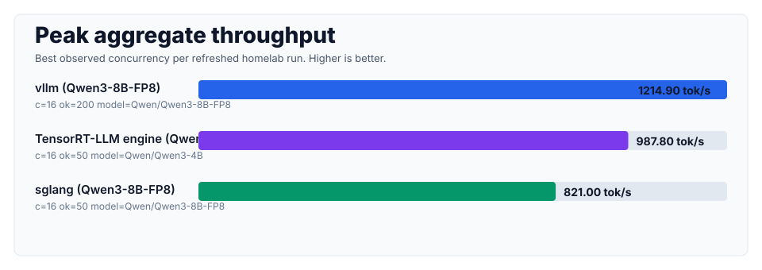
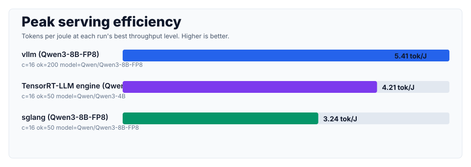
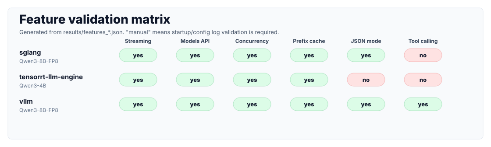

# LLM Serving Lab

A Docker Compose lab for benchmarking and observing open-source LLM serving engines on real GPU hardware.

<p align="center">
  
</p>

## Comparison Targets

| Category | Framework |
|---|---|
| Core Serving Engine | vLLM, SGLang, HuggingFace TGI, TensorRT-LLM |
| Optional Serving Platform | Ray Serve |

## Hardware Profiles

Two environments are supported. Select one from `configs/profiles/`.

| Profile | Target GPU | Memory | Default Model | Notes |
|---|---|---|---|---|
| `homelab` | RTX 5080 | 16GB | Qwen3-8B-FP8 | Single GPU, conservative 4K context |
| `datacenter` | A100 / H100 | 40~80GB+ | Llama 3.1 8B → 70B | Multi-GPU TP benchmarks |

```bash
export LAB_PROFILE=homelab      # or datacenter
source configs/profiles/${LAB_PROFILE}.env
```

> **RTX 5080 (Blackwell, sm_120) warning**: TensorRT-LLM and some frameworks require recent CUDA 12.8+ builds with compatible kernels. See the compatibility notes in `engines/*/README.md`. A 70B model is not viable with 16GB VRAM, so the homelab profile is limited to 8B-class models plus quantization.

## Latest Homelab Snapshot

The current refreshed homelab run was collected on an RTX 5080 with Prometheus/DCGM enabled. See `benchmark/summary.md` and `benchmark/features.md` for the generated tables.







| Engine | Model | Best concurrency | Agg tok/s | Tokens/J | Feature result |
|---|---|---:|---:|---:|---|
| vLLM | `Qwen/Qwen3-8B-FP8` | 16 | 1214.9 | 5.4059 | Streaming, JSON mode, and tool calling passed |
| TensorRT-LLM engine | `Qwen/Qwen3-4B` | 16 | 987.8 | 4.2090 | Streaming passed; JSON mode/tool calling returned HTTP 400 |
| SGLang | `Qwen/Qwen3-8B-FP8` | 16 | 821.0 | 3.2363 | Streaming and JSON mode passed; tool calling did not produce a tool call |
| TGI | `Qwen/Qwen3-8B-FP8` | | | | Startup warmup failed on RTX 5080 with `PassManager::run failed` |

Read the numbers with two caveats:

- vLLM was refreshed with the full homelab profile (`200` prompts per concurrency level). SGLang and TensorRT-LLM engine were refreshed with `50` prompts per level to keep the all-engine run practical.
- TensorRT-LLM is shown for the built `Qwen/Qwen3-4B` engine because the comparable `Qwen/Qwen3-8B-FP8` TensorRT-LLM serve path did not fit reliably on the 16GB homelab GPU.

## Directory Layout

```
llm-serving-lab/
├── configs/profiles/        # homelab.env / datacenter.env
├── engines/                 # Docker Compose + README per engine
│   ├── vllm/
│   ├── sglang/
│   ├── tgi/
│   ├── tensorrt-llm/
│   └── ray/
├── scripts/bench/           # Benchmark runners (TTFT/throughput/...)
├── monitoring/              # Prometheus/Grafana/DCGM plus OpenLIT notes
├── benchmark/               # Result documents per engine
├── results/                 # Raw JSON results (partially gitignored)
└── docs/                    # Docs index and supporting material
    ├── architecture/        # Serving architecture notes
    ├── labs/                # Hands-on build and benchmark labs
    ├── tools/               # Utility notes
    └── assets/              # Images and generated benchmark charts
```

## Phase Roadmap

| Phase | Scope | Output |
|---|---|---|
| 0 | Environment Setup | Docker / NVIDIA Toolkit / monitoring stack |
| 1 | Single GPU Baseline | `benchmark/*.md` (4 engines) |
| 2 | Advanced Features | Feature Matrix validation |
| 3 | Multi GPU Benchmark | TP 1/2/4 scaling analysis |
| 4 | Optional Production Serving Layer | Ray Serve routing / autoscaling / canary in front of an engine |
| 5 | Kubernetes | Out of scope for this repository; Compose-focused |
| 6 | Production Report | `docs/README.md` |

> This scaffolding is **Docker Compose-focused**. Phase 5 (K8s/Helm/ArgoCD) is intentionally recommended as a separate repository.

- [LLM Serving Landscape](docs/README.md)
- [Ray Serve to Triton Inference Server Architecture](docs/architecture/ray-triton-inference-serving.md)


Ray Serve is optional. Use it when the goal is to evaluate the production layer above an engine; skip it when the goal is only engine-level benchmarking.

## Quick Start

```bash
# 1. Select a profile
export LAB_PROFILE=homelab
source configs/profiles/${LAB_PROFILE}.env

# Optional: replace the pinned default image tags with your own tested tags or digests
# export VLLM_IMAGE=vllm/vllm-openai:<tag>

# 2. Start the monitoring stack
just mon-up

# 3. Start an engine, for example vLLM
just up vllm

# 4. Run the benchmark
just bench vllm

# 5. Validate OpenAI-compatible features and regenerate docs
just features vllm
just summarize
```

Benchmark tooling is managed with `uv` from `scripts/bench/pyproject.toml`. Run `just bench-sync` if you want to pre-create the local uv environment before the first benchmark.

For explicit TensorRT-LLM checkpoint conversion and engine builds, see
[TensorRT-LLM Conversion and Build Lab](docs/labs/tensorrt-llm-build-lab.md).

For LLM/application tracing, OpenLIT can be used alongside the default GPU metrics stack:

```bash
just openlit-up
export OPENLIT_ENABLED=true
just bench vllm
```

To include native vLLM server spans as well as benchmark client spans:

```bash
just openlit-up
export VLLM_OTEL_ARGS="--otlp-traces-endpoint grpc://host.docker.internal:4317"
just down vllm
just up vllm
export OPENLIT_ENABLED=true
just bench vllm
```

## Collected Metrics

TTFT · End-to-end Latency · Tokens/sec · GPU Memory · GPU Utilization · Power Usage · Concurrent Requests

Generated benchmark artifacts:

| Artifact | Source |
|---|---|
| `benchmark/summary.md` | `results/*.json` |
| `benchmark/features.md` | `results/features_*.json` |
| `docs/assets/benchmarks/bench-throughput.svg` | Refreshed benchmark JSON |
| `docs/assets/benchmarks/bench-efficiency.svg` | Refreshed benchmark JSON with DCGM power metrics |
| `docs/assets/benchmarks/bench-features.svg` | Feature validation JSON |

Regenerate them with:

```bash
just summarize
```

## Monitoring Choices

Use `just mon-up` for infrastructure metrics: Prometheus, Grafana, and DCGM Exporter cover engine `/metrics`, GPU utilization, VRAM, and power. Use `just openlit-up` when you also want OpenTelemetry-native traces from the benchmark client, including request spans, latency breakdowns, and optional prompt/response capture.

OpenLIT is complementary to DCGM, not a replacement for GPU measurement. See `monitoring/README.md` for the full workflow and tradeoffs.

## Reproducibility Notes

The profiles pin default container tags instead of using floating `latest` tags. For published results, record any tag or digest overrides together with the generated JSON output under `results/`.

## License

MIT
