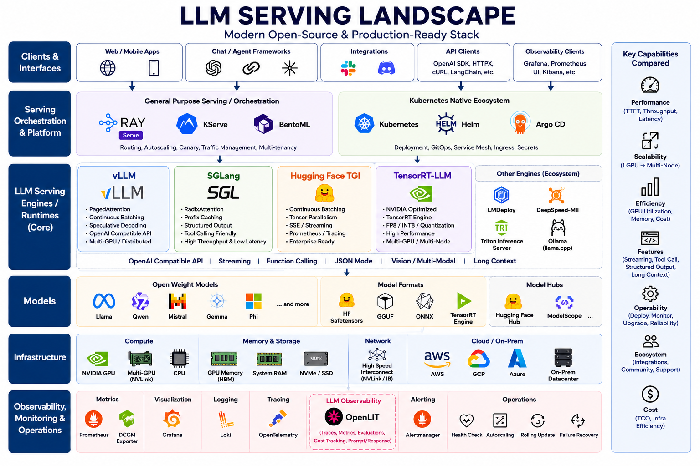

# LLM Serving Landscape

This document is the operator-facing map for this repository. The image below shows the broader open-source LLM serving ecosystem; the rest of this document narrows that landscape into what this lab builds, measures, and compares.



## Repository Scope

This repo focuses on the serving layer in the landscape image: core LLM serving engines, a production orchestration path, model/runtime compatibility, and the metrics needed to make an operational decision.

| Layer in the landscape | What this repo covers |
|---|---|
| Clients & Interfaces | OpenAI-compatible `/v1/chat/completions` benchmark traffic |
| Serving Orchestration & Platform | Ray Serve proxy scaffold as the Phase 4 production-serving layer |
| LLM Serving Engines / Runtimes | vLLM, SGLang, Hugging Face TGI, TensorRT-LLM |
| Models | Qwen3-8B for homelab, Llama 3.1 8B and larger TP targets for datacenter |
| Infrastructure | Single-GPU RTX 5080 profile and multi-GPU A100/H100 profile |
| Observability, Monitoring & Operations | Prometheus, Grafana, DCGM Exporter, optional OpenLIT tracing, health checks, benchmark JSON outputs |

The main decision this lab is designed to answer is:

> Which serving engine should an operator choose for a given workload, and when does a platform layer like Ray become necessary?

## Stack Layers

### 1. Clients and API Shape

All benchmarked engines are expected to expose an OpenAI-compatible chat-completions endpoint:

```text
/v1/chat/completions
```

The benchmark runner sends streaming requests through that API so TTFT, end-to-end latency, throughput, and token rates are comparable across engines.

### 2. Serving Engines

The core comparison set is intentionally small and operationally relevant:

| Engine | Why it is included | Repo path |
|---|---|---|
| vLLM | Strong default for OpenAI-compatible serving, continuous batching, prefix caching, and fast MVPs | `engines/vllm/` |
| SGLang | Strong fit for structured output, tool calling, prefix caching, and agent workflows | `engines/sglang/` |
| Hugging Face TGI | Useful when Hugging Face ecosystem integration and enterprise operation are primary constraints | `engines/tgi/` |
| TensorRT-LLM | NVIDIA-optimized path for maximum performance when build complexity is acceptable | `engines/tensorrt-llm/` |

Other engines shown in the image, such as LMDeploy, DeepSpeed-MII, Triton Inference Server, and Ollama, are ecosystem context rather than first-class benchmark targets in this repo.

### 3. Orchestration

The image separates single-engine serving from orchestration platforms. This repo follows the same split:

- Phase 1 and Phase 2 benchmark the engines directly through Docker Compose.
- Phase 3 evaluates tensor parallel scaling on datacenter GPUs.
- Phase 4 introduces a minimal Ray Serve proxy scaffold for routing experiments, then expands toward autoscaling, canary releases, rolling updates, and failure recovery.
- Kubernetes, Helm, Argo CD, and KubeRay are treated as a follow-up production repository rather than part of this Compose-first lab.

### 4. Models, Formats, and Hubs

This lab uses Hugging Face-hosted models and keeps model choices profile-specific:

| Profile | Default model | Intent |
|---|---|---|
| `homelab` | `Qwen/Qwen3-8B-FP8` | Fit an 8B-class model into 16GB VRAM with an official FP8 checkpoint and conservative 4K context |
| `datacenter` | `meta-llama/Llama-3.1-8B-Instruct` | Establish an 8B baseline on A100/H100 |
| `datacenter` Phase 3 | `Qwen/Qwen3-32B`, `meta-llama/Llama-3.3-70B-Instruct` | Evaluate multi-GPU tensor parallel scaling |

The landscape image also calls out formats such as Safetensors, GGUF, ONNX, and TensorRT Engine. In this repo, TensorRT-LLM is the path where model conversion and engine artifacts matter most.

### 5. Infrastructure

The lab is built around two concrete operating environments:

| Profile | GPU target | Operational constraint |
|---|---|---|
| `homelab` | RTX 5080, 16GB | Small VRAM budget, Blackwell compatibility, quantization-first |
| `datacenter` | A100/H100, 40-80GB+ | Multi-GPU tensor parallelism and larger-model scaling |

Profiles live in `configs/profiles/` and define model IDs, tensor parallel size, GPU visibility, memory utilization, benchmark load, and image tag variables.

### 6. Observability and Operations

The landscape image highlights that serving decisions are not only about raw latency. This repo collects or prepares for:

| Capability | Repo mechanism |
|---|---|
| Performance | `scripts/bench/run_benchmark.py` for TTFT, E2E latency, throughput, and tokens/sec |
| Efficiency | DCGM metrics for GPU utilization, VRAM, and power |
| Features | `scripts/bench/validate_features.py` for streaming, JSON mode, and tool calling checks |
| Operability | Compose health checks, pinned image variables, benchmark result templates |
| Monitoring | Prometheus, Grafana, DCGM Exporter, and optional OpenLIT notes under `monitoring/` |

### 7. OpenLIT in This Lab

OpenLIT sits above the infrastructure metrics layer. It instruments the benchmark client and exports OpenTelemetry traces to a local OpenLIT stack. This is useful for inspecting request-level behavior and correlating latency with model/provider calls.

| Question | Best tool in this repo |
|---|---|
| How much GPU memory did the engine use? | Prometheus + DCGM Exporter |
| What was GPU utilization during the run? | Prometheus + DCGM Exporter |
| Which benchmark requests were slow or failed? | Benchmark JSON plus OpenLIT traces |
| What did the client send and receive? | OpenLIT, only if `OPENLIT_CAPTURE_MESSAGE_CONTENT=true` |
| Which engine should I choose? | Benchmark tables plus the decision matrix below |

OpenLIT is disabled by default. Enable it only for runs where traces are useful:

```bash
just openlit-up
export OPENLIT_ENABLED=true
just bench vllm
```

## Benchmark Methodology

Use the same profile, model, quantization policy, context length, image tags, and request shape when comparing engines.

The benchmark runner records:

- TTFT p50/p95
- E2E latency p50/p95
- aggregate tokens/sec
- throughput in requests/sec
- failed request counts and sample errors
- token-count source
- actual prompt token count
- observability backend and OTLP endpoint when OpenLIT is enabled
- image variables used for the run

Token accounting prefers streamed API usage tokens. If the engine does not return usage in streaming responses, the runner falls back to the model tokenizer when available, then to a word-count estimate.

## Decision Matrix

| Scenario | First engine to try | Why |
|---|---|---|
| Fast OpenAI-compatible MVP | vLLM | Lowest friction, mature API compatibility, strong batching behavior |
| Agent workflow or structured output | SGLang | Designed around structured generation, tool calling, and prefix-cache-heavy flows |
| Hugging Face-centered operations | TGI | Fits HF model lifecycle and enterprise-serving conventions |
| Maximum NVIDIA performance | TensorRT-LLM | Best fit when build complexity and hardware-specific tuning are acceptable |
| Multi-tenant production routing | Ray + vLLM or Ray + SGLang | Adds routing, autoscaling, rollout control, and failure recovery |
| Kubernetes-native production | KubeRay/Ray Serve plus selected engine | Out of scope here, but this is the natural next layer from the landscape |

## How to Use This Document

Start with the landscape image to understand where each component belongs. Then run the lab in phases:

1. Use `README.md` for setup and quick start.
2. Use `benchmark/*.md` as the per-engine result log.
3. Use `configs/profiles/` to switch between homelab and datacenter assumptions.
4. Use this document as the final decision narrative once benchmark data is available.
