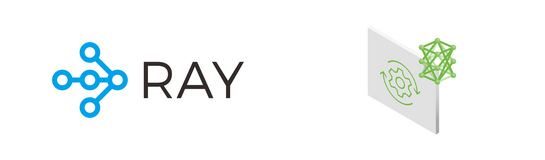
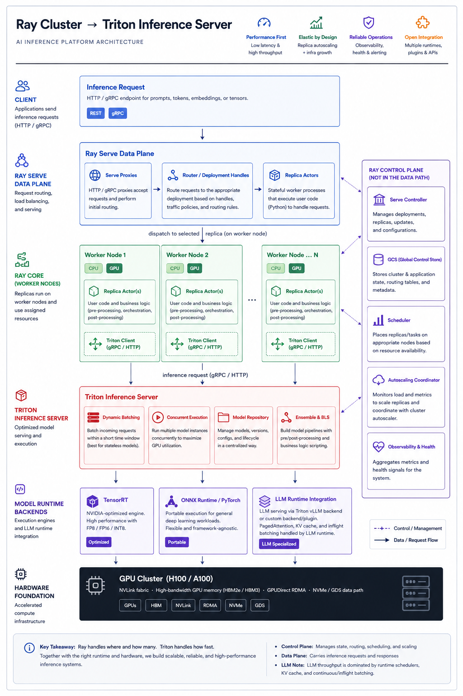
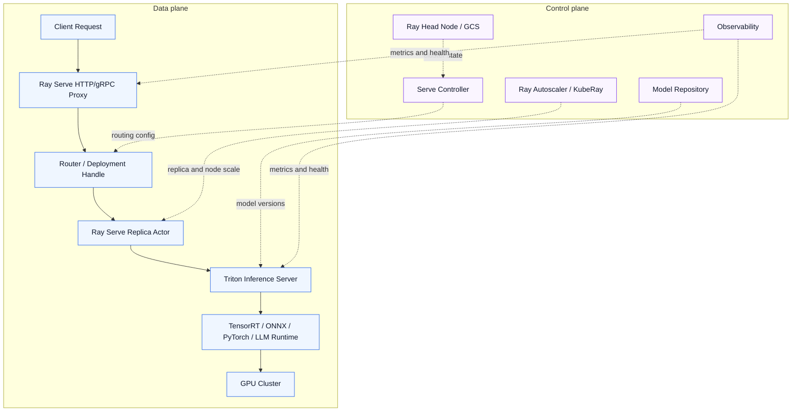
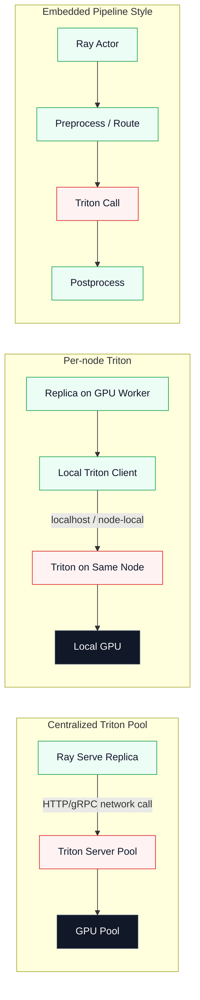
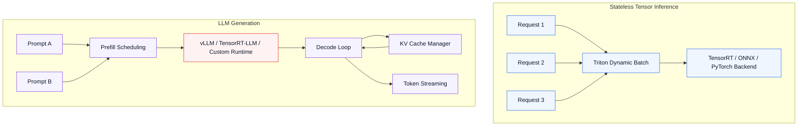
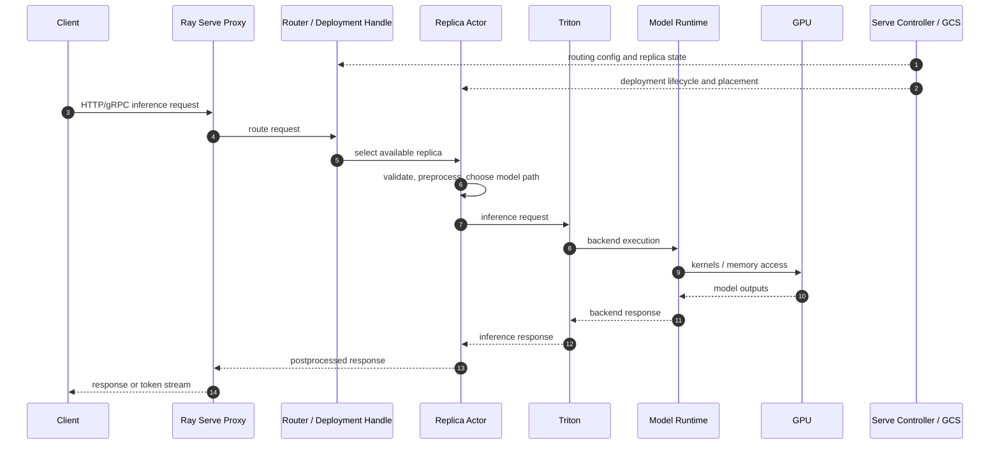

# Ray Cluster에서 Triton Inference Server까지: 확장 가능한 AI Inference Serving Architecture

AI 모델을 실제 서비스에 배포할 때 가장 어려운 부분은 단순히 모델을 실행하는 것이 아니다.
진짜 어려운 문제는 **요청을 안정적으로 받고, GPU 자원을 효율적으로 배치하며, 모델 실행을 빠르게 최적화하고, 운영 가능한 형태로 확장하는 것**이다.

이 문서는 `Ray Cluster → Triton Inference Server` 구조를 기준으로, 대규모 AI inference platform이 어떤 계층으로 구성되는지 설명한다.

<p align="center">
  
</p>

## Table of Contents

- [1. 왜 Ray와 Triton을 함께 사용하는가?](#1-왜-ray와-triton을-함께-사용하는가)
- [2. Client Layer: Inference Request](#2-client-layer-inference-request)
- [3. Ray Serve Layer: Frontend Serving Plane](#3-ray-serve-layer-frontend-serving-plane)
- [4. Ray Core Layer: Head Node와 Worker Node](#4-ray-core-layer-head-node와-worker-node)
  - [4.1 Head Node](#41-head-node)
  - [4.2 Worker Node](#42-worker-node)
- [5. Ray에서 Triton으로: Model Server Dispatch](#5-ray에서-triton으로-model-server-dispatch)
  - [5.1 Centralized Triton Server](#51-centralized-triton-server)
  - [5.2 Per-node Triton Server](#52-per-node-triton-server)
  - [5.3 Embedded Pipeline Style](#53-embedded-pipeline-style)
- [6. Triton Inference Server Layer](#6-triton-inference-server-layer)
- [7. Model Pipeline Layer](#7-model-pipeline-layer)
  - [7.1 Triton Ensemble](#71-triton-ensemble)
  - [7.2 Business Logic Scripting](#72-business-logic-scripting)
  - [7.3 Ensemble vs BLS vs Ray Serve](#73-ensemble-vs-bls-vs-ray-serve)
- [8. Model Runtime Layer](#8-model-runtime-layer)
  - [8.1 TensorRT](#81-tensorrt)
  - [8.2 ONNX Runtime / PyTorch](#82-onnx-runtime--pytorch)
  - [8.3 LLM Runtime Integration](#83-llm-runtime-integration)
    - [Continuous / Inflight Batching](#continuous--inflight-batching)
- [9. Hardware Foundation: GPU Cluster](#9-hardware-foundation-gpu-cluster)
- [10. System Properties](#10-system-properties)
  - [10.1 Performance First](#101-performance-first)
  - [10.2 Elastic by Design](#102-elastic-by-design)
  - [10.3 Reliable Operations](#103-reliable-operations)
  - [10.4 Open Integration](#104-open-integration)
- [11. End-to-End Request Flow](#11-end-to-end-request-flow)
- [12. Design Trade-offs](#12-design-trade-offs)
  - [12.1 Ray Serve vs Triton Ensemble/BLS](#121-ray-serve-vs-triton-ensemblebls)
  - [12.2 Centralized Triton vs Per-node Triton](#122-centralized-triton-vs-per-node-triton)
  - [12.3 TensorRT vs ONNX/PyTorch vs LLM Runtime](#123-tensorrt-vs-onnxpytorch-vs-llm-runtime)
- [13. Recommended Production Architecture](#13-recommended-production-architecture)
- [14. Practical Notes](#14-practical-notes)
  - [14.1 Request Timeout](#141-request-timeout)
  - [14.2 GPU Memory](#142-gpu-memory)
  - [14.3 Dynamic Batching](#143-dynamic-batching)
  - [14.4 Model Versioning](#144-model-versioning)
  - [14.5 Observability](#145-observability)
- [15. Summary](#15-summary)
- [16. References](#16-references)



전체 구조는 control plane과 data plane을 분리해서 이해해야 한다.

```text
Control plane
  Ray Head Node / GCS / Serve Controller / Autoscaler
      ↓ places and supervises
  Ray Serve replicas and worker actors

Data plane
  Client Request
      ↓
  Ray Serve HTTP/gRPC Proxy
      ↓
  Router / DeploymentHandle
      ↓
  Ray Serve Replica Actor
      ↓
  Triton Inference Server / Model Pipeline
      ↓
  Model Runtime
      ↓
  GPU Cluster
```

같은 내용을 Mermaid로 표현하면 다음과 같다.



핵심 메시지는 단순하다.

> Ray handles placement, routing, and scale.
> Triton optimizes execution.
> Together they form the serving plane.

즉, **Ray는 모델 serving workload를 어디에, 얼마나, 어떤 방식으로 배치하고 라우팅할지 결정하고**, **Triton은 실제 모델 실행을 빠르게 처리하는 역할**을 담당한다.


## 1. 왜 Ray와 Triton을 함께 사용하는가?

AI inference system은 크게 두 가지 문제를 동시에 해결해야 한다.

첫 번째는 **serving orchestration** 문제다.

요청이 들어왔을 때 어떤 replica가 처리할 것인지, GPU가 부족하면 어떻게 확장할 것인지, 여러 모델 또는 여러 버전 사이에서 traffic을 어떻게 나눌 것인지 결정해야 한다.

두 번째는 **model execution optimization** 문제다.

GPU 위에서 모델을 어떻게 빠르게 실행할 것인지, batching을 어떻게 할 것인지, TensorRT/ONNX/PyTorch/vLLM 같은 runtime을 어떻게 사용할 것인지 결정해야 한다.

Ray와 Triton은 이 두 영역을 나누어 담당한다.

| Layer                   | Main Responsibility                                                                |
| ----------------------- | ---------------------------------------------------------------------------------- |
| Ray Serve               | HTTP/gRPC proxying, request routing, autoscaling, traffic splitting, replica management |
| Ray Core                | Actor/task placement, worker execution, cluster resource management                |
| Triton Inference Server | Model serving, dynamic batching, concurrent execution, model repository management |
| Model Runtime           | TensorRT, ONNX Runtime, PyTorch, LLM runtime integration                           |
| GPU Cluster             | Actual accelerated compute infrastructure                                          |

Ray만 사용하면 분산 serving과 autoscaling은 강력하지만, 모델 실행 최적화 측면에서는 별도의 runtime 전략이 필요하다.

반대로 Triton만 사용하면 모델 실행은 강력하지만, 복잡한 분산 orchestration, multi-service routing, autoscaling policy, actor 기반 pipeline 구성은 Ray가 더 자연스럽게 처리할 수 있다.

그래서 둘을 함께 사용하면 다음과 같은 구조가 된다.

```text
Ray = where, who receives traffic, and how many
Triton = how fast
```


## 2. Client Layer: Inference Request

가장 상단에는 client request가 있다.

```text
HTTP / gRPC endpoint for prompts, tokens, or embeddings payloads.
```

Client는 일반적으로 REST 또는 gRPC endpoint를 통해 inference request를 보낸다.

요청 payload는 workload 유형에 따라 달라진다.

예를 들어 일반적인 deep learning inference라면 image, tensor, feature vector가 들어올 수 있다.
LLM serving이라면 prompt, input tokens, chat messages, embedding request가 들어올 수 있다.

이 계층에서 중요한 것은 protocol 자체보다 **요청을 serving layer로 안정적으로 전달하는 것**이다.

대표적인 고려사항은 다음과 같다.

| Concern        | Description                         |
| -------------- | ----------------------------------- |
| Protocol       | REST, gRPC                          |
| Payload        | Prompt, tokens, embeddings, tensors |
| Authentication | API key, JWT, internal service auth |
| Rate limit     | Tenant별 request 제한                  |
| Timeout        | Long-running generation request 처리  |
| Streaming      | LLM token streaming 지원 여부           |

Client request는 이후 Ray Serve frontend로 전달된다.


## 3. Ray Serve Layer: Frontend Serving Plane

Ray Serve는 Ray 위에서 동작하는 model serving framework다.

그림에서는 다음과 같은 역할로 표현된다.

```text
Ray Serve (Frontend)
Autoscaling replicas. Traffic splitting. Load balancing across replicas.
```

Ray Serve는 외부 요청을 받아 내부 replica로 전달한다. 이때 Ray Serve는 단일 컴포넌트라기보다 proxy, controller, router, replica actor로 나뉜다.

주요 기능은 다음과 같다.

| Feature               | Description                         |
| --------------------- | ----------------------------------- |
| Autoscaling           | 요청량에 따라 replica 수를 자동 조절            |
| Traffic Splitting     | 모델 버전 또는 deployment 간 traffic 분배    |
| Load Balancing        | 여러 replica 사이에 요청 분산                |
| Deployment Graph      | 여러 deployment를 조합한 serving graph 구성 |
| Python-native Serving | Python 코드 기반으로 inference service 구성 |

운영 관점에서는 다음 컴포넌트 구분이 중요하다.

| Component | Plane | Responsibility |
|---|---|---|
| HTTP/gRPC Proxy | Data plane | 외부 요청을 받고 Serve application으로 진입시킴 |
| Serve Controller | Control plane | Deployment config, routing policy, replica lifecycle 관리 |
| Router / DeploymentHandle | Data plane | 요청을 적절한 deployment replica로 전달 |
| Replica Actor | Data plane | 사용자 코드 실행, preprocessing, Triton dispatch, postprocessing |
| Ray Autoscaler / KubeRay | Control plane | replica 배치에 필요한 node와 resource 확장 |

예를 들어 하나의 LLM service를 운영한다고 가정해보자.

```text
/llm/generate
/embedding
/rerank
/classify
```

이런 endpoint들을 Ray Serve deployment로 나누고, 각 deployment가 내부적으로 Triton endpoint를 호출하도록 구성할 수 있다.

Ray Serve의 장점은 단순히 모델을 실행하는 것이 아니라, **서비스 단위의 inference application을 구성하기 좋다**는 점이다.

예를 들어 다음과 같은 작업을 Ray Serve 계층에서 처리할 수 있다.

```text
Request validation
Prompt preprocessing
Tenant-based routing
A/B test routing
Fallback model selection
Model pipeline orchestration
Triton endpoint dispatch
Response post-processing
```

즉, Ray Serve는 inference system의 frontend이자 application-level serving plane 역할을 한다. 다만 실제 request data path는 `proxy → router/handle → replica actor`로 흐르고, Serve Controller와 Ray Head Node는 그 경로를 설정하고 감시하는 control plane에 가깝다.


## 4. Ray Core Layer: Head Node와 Worker Node

Ray Serve 아래에는 Ray Core가 있다.

Ray Core는 Ray cluster의 분산 실행 기반이다.

그림에서는 두 가지 구성 요소로 나뉜다.

```text
Head Node
Worker Node xN
```


### 4.1 Head Node

Head Node는 Ray cluster의 중심 control node다.

그림에서는 다음과 같이 설명된다.

```text
GCS, scheduler, dashboard.
Tracks cluster state and resource availability.
```

Head Node는 cluster 상태를 관리하고, scheduler를 통해 task와 actor를 적절한 worker node에 배치한다.

주요 역할은 다음과 같다.

| Component        | Role                                        |
| ---------------- | ------------------------------------------- |
| GCS              | Global Control Store. Cluster metadata 관리   |
| Scheduler        | Task/actor placement 결정                     |
| Dashboard        | Cluster 상태와 workload 모니터링                   |
| Resource Tracker | CPU, GPU, memory 등 resource availability 추적 |

Head Node는 실제 GPU computation이나 inference request forwarding을 담당한다기보다는, **cluster 전체의 control plane** 역할을 한다.


### 4.2 Worker Node

Worker Node는 실제 workload가 실행되는 node다.

그림에서는 다음과 같이 표현된다.

```text
Runs remote actors and tasks.
Each node hosts GPU resources assigned by the scheduler.
```

Ray에서 workload는 주로 task 또는 actor 형태로 실행된다.

| Concept      | Description                              |
| ------------ | ---------------------------------------- |
| Task         | Stateless remote function execution      |
| Actor        | Stateful worker process                  |
| GPU Resource | `num_gpus` 기반으로 Ray scheduler가 할당        |
| Placement    | 특정 node, 특정 resource constraint 기반 배치 가능 |

Inference serving에서는 일반적으로 model replica 또는 pipeline stage가 actor 형태로 동작할 수 있다.

예를 들어 Ray Serve replica가 worker node 위에서 실행되고, 해당 replica가 local Triton server 또는 remote Triton endpoint로 요청을 넘기는 구조를 만들 수 있다.


## 5. Ray에서 Triton으로: Model Server Dispatch

Ray Serve replica가 선택된 이후 다음 단계는 model server로 요청을 넘기는 것이다.

정확한 data path는 다음과 같이 보는 것이 안전하다.

```text
Client
  → Ray Serve Proxy
  → Router / DeploymentHandle
  → Ray Serve Replica Actor on Worker Node
  → Triton Inference Server or Model Pipeline
```

Head Node, GCS, Serve Controller는 replica placement, routing configuration, lifecycle management를 담당하지만, 일반적인 inference request payload를 Triton으로 직접 forward하지 않는다.

여기서 중요한 점은 Triton을 배치하는 방식이 하나로 고정되어 있지 않다는 것이다.

대표적으로 세 가지 방식이 가능하다.




### 5.1 Centralized Triton Server

하나 또는 여러 개의 Triton server를 독립적인 serving pool로 운영하고, Ray Serve replica가 network call을 통해 Triton에 요청을 보낸다.

```text
Ray Serve Replica
    ↓ HTTP/gRPC
Triton Inference Server
    ↓
GPU
```

이 방식은 구조가 명확하고 운영이 단순하다.

다만 Ray worker와 Triton server 사이의 network hop이 추가될 수 있다.


### 5.2 Per-node Triton Server

각 GPU worker node마다 Triton server를 배치하고, Ray actor가 같은 node의 Triton server로 요청을 보낸다.

```text
Ray Worker Node
  ├── Ray Serve Replica
  └── Triton Server
```

이 방식은 data locality를 활용하기 좋다.

Ray actor와 Triton server가 같은 node에 있다면 network overhead를 줄일 수 있고, GPU affinity를 명확하게 관리할 수 있다.


### 5.3 Embedded Pipeline Style

Ray actor가 preprocessing, routing, postprocessing을 담당하고, Triton은 순수한 model execution backend처럼 사용된다.

```text
Ray Actor
  ├── preprocessing
  ├── Triton inference call
  └── postprocessing
```

이 방식은 복잡한 business logic이나 multi-model pipeline을 구성하기 좋다.


## 6. Triton Inference Server Layer

Triton Inference Server는 NVIDIA에서 제공하는 고성능 inference server다.

그림에서는 다음과 같은 기능을 담당한다.

```text
Dynamic batching.
Concurrent model execution.
Model repository management.
Per-model configuration.
```

Triton의 핵심 역할은 모델 실행을 production-grade serving 형태로 제공하는 것이다.

주요 기능은 다음과 같다.

| Feature              | Description                          |
| -------------------- | ------------------------------------ |
| Dynamic Batching     | Stateless model request를 micro-batch로 처리 |
| Concurrent Execution | 여러 model instance 동시 실행              |
| Model Repository     | 모델 파일과 config 관리                     |
| Model Versioning     | 모델 버전 관리                             |
| Multiple Backends    | TensorRT, ONNX Runtime, PyTorch 등 지원 |
| Metrics              | Prometheus metrics 제공                |
| HTTP/gRPC API        | 표준 inference API 제공                  |

Triton의 강점은 **GPU utilization을 높이기 위한 inference execution optimization**에 있다.

특히 작은 stateless request가 자주 들어오는 vision, encoder, ranking, classical tensor workload에서는 dynamic batching이 중요하다.

예를 들어 request가 하나씩 들어오면 GPU utilization이 낮을 수 있다.
Triton은 짧은 시간 window 안에 들어온 request를 묶어서 batch inference로 실행할 수 있다.

```text
Request 1 ┐
Request 2 ├── Dynamic Batch ── GPU Execution
Request 3 ┘
```

이 방식은 latency와 throughput 사이의 trade-off를 조절하는 데 중요하다.

Dynamic batching은 **여러 독립 request를 짧은 queue window 동안 모아서 하나의 backend batch로 실행하는 기능**이다. Client가 직접 batch를 만들어 보내지 않아도 Triton이 server side에서 batch를 구성한다.

핵심 파라미터는 다음과 같다.

| Parameter | Meaning | Tuning Direction |
|---|---|---|
| `max_batch_size` | 모델이 받을 수 있는 최대 batch dimension | GPU memory와 latency SLO 안에서 가능한 상한 설정 |
| `preferred_batch_size` | Triton이 우선적으로 만들려고 하는 batch 크기 | TensorRT engine이나 workload가 특정 batch에서 빠를 때 사용 |
| `max_queue_delay_microseconds` | batch를 만들기 위해 request를 기다릴 수 있는 최대 시간 | throughput을 높이려면 증가, p95/p99 latency를 낮추려면 감소 |
| `instance_group` | model instance 수와 GPU 배치 | concurrency와 GPU utilization을 조절 |
| `preserve_ordering` | response order 보존 여부 | strict ordering이 필요할 때만 사용 |

간단한 `config.pbtxt` 예시는 다음과 같다.

```protobuf
max_batch_size: 16

dynamic_batching {
  preferred_batch_size: [4, 8, 16]
  max_queue_delay_microseconds: 1000
}

instance_group [
  {
    count: 2
    kind: KIND_GPU
  }
]
```

이 설정은 request를 최대 1ms까지 기다리면서 4, 8, 16 크기의 batch를 우선적으로 만들고, GPU 위에 model instance 2개를 띄우는 예시다. 실제 최적값은 model shape, backend, GPU memory, request arrival rate, latency SLO에 따라 달라진다.

Dynamic batching이 특히 잘 맞는 workload는 다음과 같다.

| Good Fit | Why |
|---|---|
| Image classification / detection | 짧은 stateless request가 많고 batch dimension이 명확함 |
| Embedding / encoder model | request 간 state 공유가 없고 batch 처리 효율이 큼 |
| Reranking / scoring | 동일 shape 또는 유사 shape request를 묶기 쉬움 |
| Classical tensor inference | request가 독립적이고 response가 한 번에 반환됨 |

반대로 다음 상황에서는 조심해야 한다.

| Risk | Explanation |
|---|---|
| Strict low-latency p99 SLO | queue delay가 tail latency를 악화시킬 수 있음 |
| Highly variable input shapes | padding 또는 shape mismatch 때문에 batch 효율이 낮아질 수 있음 |
| Stateful sequence workload | sequence order와 state 관리가 필요해 dynamic batcher만으로 부족함 |
| Token streaming LLM | decode loop와 KV cache scheduling이 runtime scheduler에 더 크게 좌우됨 |

다만 LLM serving에서는 이 설명만으로는 부족하다. Autoregressive generation은 prefill과 decode 단계, KV cache, token streaming, request별 sequence state를 함께 다루기 때문에 일반적인 Triton dynamic batching보다 runtime scheduler의 continuous batching 또는 inflight batching이 더 핵심인 경우가 많다.

따라서 Triton 계층의 batching은 workload별로 나누어 봐야 한다.

| Workload | Primary scheduling concern |
|---|---|
| Stateless tensor inference | Triton dynamic batching, instance group placement |
| Stateful sequence inference | Triton sequence batching or runtime-managed state |
| LLM generation | Runtime-level continuous/inflight batching, KV cache scheduling, prefill/decode coordination |




## 7. Model Pipeline Layer

Triton은 단일 모델 실행뿐 아니라 ensemble model pipeline도 지원한다.

그림에서는 다음과 같이 표현된다.

```text
Model Pipeline
Ensemble pipelines. Pre/post-processing.
Multi-model chaining without client round-trips.
```

일반적인 inference workload는 단일 모델 호출로 끝나지 않는다.

예를 들어 image inference pipeline은 다음처럼 구성될 수 있다.

```text
Image Decode
    ↓
Preprocess
    ↓
Object Detection Model
    ↓
Postprocess
    ↓
Response
```

LLM 기반 pipeline이라면 다음과 같은 구조도 가능하다.

```text
Prompt Validation
    ↓
Embedding
    ↓
Retriever
    ↓
Reranker
    ↓
LLM Generation
    ↓
Post-processing
```

Triton의 ensemble 기능을 사용하면 client가 여러 번 round-trip하지 않아도 server 내부에서 pipeline을 연결할 수 있다.

또한 BLS, 즉 Business Logic Scripting을 사용하면 Python 기반의 custom logic을 Triton model pipeline 안에 포함할 수 있다.

다만 복잡한 application-level orchestration은 Ray Serve가 더 자연스럽고, model execution 근처의 pipeline은 Triton ensemble이 더 적합할 수 있다.

따라서 실무에서는 다음처럼 역할을 나누는 것이 좋다.

| Layer               | Good For                                                     |
| ------------------- | ------------------------------------------------------------ |
| Ray Serve           | Application-level orchestration, routing, autoscaling        |
| Triton Ensemble/BLS | Model-level pipeline, pre/post-processing close to inference |
| Custom Service      | Business logic, external API integration                     |

### 7.1 Triton Ensemble

Triton Ensemble은 여러 model 또는 처리 단계를 하나의 model처럼 노출하는 **정적인 DAG pipeline**이다.

```text
Client
  ↓
Triton Ensemble Model
  ├── preprocess model
  ├── TensorRT / ONNX / PyTorch model
  └── postprocess model
  ↓
Response
```

Client 입장에서는 여러 model을 순서대로 호출하는 것이 아니라 ensemble model 하나만 호출한다.

```text
client → ensemble_model → response
```

Triton 내부에서는 `config.pbtxt`에 정의된 step, input/output tensor mapping, model dependency에 따라 각 단계를 실행한다. 이 구조는 `preprocess → inference → postprocess`처럼 흐름이 고정되어 있고 tensor 연결이 명확한 pipeline에 잘 맞는다.

예를 들어 image inference에서는 다음처럼 구성할 수 있다.

```text
JPEG Decode
  → Resize / Normalize
  → TensorRT Detection Model
  → NMS / Postprocess
```

NLP encoder나 ranking workload에서는 다음처럼 구성할 수 있다.

```text
Tokenize
  → ONNX / TensorRT Encoder
  → Classification Head
  → Label Mapping
```

Ensemble의 장점은 다음과 같다.

| Strength | Description |
|---|---|
| Fewer client round-trips | 여러 model call을 Triton 내부에서 처리 |
| Efficient tensor handoff | 중간 tensor를 client로 반환하지 않고 server 내부에서 전달 |
| Declarative pipeline | `config.pbtxt`로 step과 tensor mapping 정의 |
| Repository-level operation | Triton model repository 안에서 pipeline version 관리 |
| Backend optimization | 각 step이 TensorRT, ONNX Runtime, Python backend 등 Triton backend 최적화를 받을 수 있음 |

반대로 Ensemble은 정적인 DAG에 가깝기 때문에 복잡한 제어 흐름에는 적합하지 않다.

```text
if confidence < threshold:
    run fallback_model
else:
    return result

for candidate in candidates:
    run reranker(candidate)

if tenant == "premium":
    use large_model
else:
    use small_model
```

이런 조건 분기, 반복, fallback, tenant별 model 선택은 Ensemble만으로 표현하기 어렵거나 운영하기 불편하다.

### 7.2 Business Logic Scripting

BLS, 즉 Business Logic Scripting은 Triton Python Backend model 안에서 다른 Triton model에 inference request를 보내고 결과를 조합하는 방식이다. 쉽게 말하면 Triton 내부에 Python orchestration model을 하나 두는 구조다.

```text
Client
  ↓
Python Backend Model with BLS
  ├── call fast_model
  ├── inspect result
  ├── maybe call fallback_model
  ├── maybe call reranker_model
  └── build response
  ↓
Response
```

BLS는 **동적인 제어 흐름**이 필요할 때 유용하다.

예를 들어 confidence 기반 fallback은 다음과 같은 형태가 된다.

```python
result = infer("fast_model", input)

if result.confidence < 0.7:
    result = infer("accurate_model", input)

return result
```

Tenant별 model 선택도 BLS에서 자연스럽게 표현할 수 있다.

```python
if tenant == "premium":
    model_name = "large_model"
else:
    model_name = "small_model"

result = infer(model_name, input)
```

BLS가 잘 맞는 패턴은 다음과 같다.

| Pattern | Description |
|---|---|
| Conditional routing | model output, metadata, tenant 정보에 따라 다음 model 선택 |
| Fallback | fast model 실패, timeout, 낮은 confidence 시 heavy model 호출 |
| Dynamic model selection | language, input type, tenant tier에 따라 model 선택 |
| Iterative processing | 후보군 반복 처리, loop, multi-stage ranking |
| Result fusion | 여러 model 결과를 Python logic으로 병합 |
| Custom post-processing | 단순 tensor mapping을 넘는 domain-specific 후처리 |

BLS의 장점은 표현력이지만, 비용도 있다. Python logic이 들어가므로 latency variance, debugging complexity, dependency management, observability 설계를 더 신경 써야 한다. 모델 실행에 가까운 얇은 orchestration에는 좋지만, 인증, tenant 정책, API routing, rollout, autoscaling 같은 service-level logic까지 BLS에 넣으면 Triton model server가 application server처럼 비대해질 수 있다.

### 7.3 Ensemble vs BLS vs Ray Serve

핵심 차이는 **선언형 pipeline이냐, Triton-local Python orchestration이냐, application-level serving orchestration이냐**다.

| Choice | Best For | Avoid When |
|---|---|---|
| Triton Ensemble | 고정된 `preprocess → model → postprocess` DAG | 조건 분기, 반복, dynamic routing이 많음 |
| Triton BLS | model-server-local fallback, dynamic model call, result fusion | service-level auth, tenant policy, autoscaling, rollout logic이 큼 |
| Ray Serve | API-level routing, tenant policy, traffic split, canary, autoscaling, multi-service graph | 단순 tensor pre/post-processing만 필요한 경우 |

실무 판단 기준은 다음처럼 단순화할 수 있다.

```text
흐름이 고정되어 있다
  → Triton Ensemble

Triton 내부에서 조건/분기/반복이 필요하다
  → Triton BLS

서비스 레벨 orchestration이 크다
  → Ray Serve
```

Ray + Triton 구조에서는 다음 역할 분리가 가장 안전하다.

```text
Ray Serve
  = application-level orchestration
    auth, tenant routing, traffic split, canary, fallback policy, autoscaling

Triton Ensemble / BLS
  = model-server-local pipeline orchestration
    preprocess, model chaining, postprocess, local fallback, result fusion
```

예를 들어 권장되는 request path는 다음과 같다.

```text
Client
  ↓
Ray Serve
  ├── auth / tenant routing / API-level policy
  ├── deployment selection
  └── call Triton ensemble
        ├── preprocess
        ├── TensorRT model
        └── postprocess
```

더 동적인 model-server-local 로직이 필요하면 Ray Serve가 BLS model을 호출하고, BLS가 Triton 내부 model들을 조합할 수 있다.

```text
Client
  ↓
Ray Serve
  ├── request validation
  ├── tenant policy
  └── call Triton BLS model
        ├── call fast_model
        ├── inspect confidence
        ├── maybe call accurate_model
        └── merge response
```

이렇게 나누면 Ray Serve는 system-level serving plane으로 남고, Triton은 model execution에 가까운 pipeline과 backend optimization에 집중할 수 있다.


## 8. Model Runtime Layer

Triton 아래에는 실제 모델을 실행하는 runtime/backend 계층이 있다.

그림에서는 세 가지 경로로 표현된다.

```text
TensorRT
ONNX / PyTorch
LLM Runtime Integration
```


### 8.1 TensorRT

TensorRT는 NVIDIA GPU에 최적화된 inference engine이다.

그림에서는 다음과 같이 표현된다.

```text
NVIDIA-optimized engine.
High throughput with FP8 / INT8 acceleration.
```

TensorRT는 모델 graph optimization, kernel fusion, precision calibration, quantization 등을 통해 GPU inference 성능을 높인다.

특히 고정된 input shape 또는 제한된 shape profile을 가진 workload에서 강력하다.

대표적인 장점은 다음과 같다.

| Strength                | Description                       |
| ----------------------- | --------------------------------- |
| High Throughput         | GPU inference 성능 최적화              |
| Low Latency             | Kernel fusion, graph optimization |
| Quantization            | FP16, INT8, FP8 등 활용 가능           |
| NVIDIA GPU Optimization | NVIDIA GPU에 특화된 실행 경로             |

하지만 TensorRT는 build 과정과 compatibility 관리가 필요하다.

특히 LLM에서는 model architecture, GPU architecture, TensorRT-LLM version, CUDA version, quantization format에 따라 build와 runtime 안정성이 크게 달라질 수 있다.


### 8.2 ONNX Runtime / PyTorch

ONNX Runtime과 PyTorch backend는 portability와 flexibility에 강점이 있다.

그림에서는 다음과 같이 표현된다.

```text
Portable execution path for general deep learning workloads.
```

ONNX는 여러 framework에서 export된 모델을 표준 graph 형태로 실행할 수 있게 해준다.

PyTorch backend는 PyTorch model을 비교적 자연스럽게 serving할 수 있게 해준다.

| Runtime        | Good For                                                |
| -------------- | ------------------------------------------------------- |
| ONNX Runtime   | Framework-neutral model serving                         |
| PyTorch        | Flexible model execution, research-to-production bridge |
| Torch-TensorRT | PyTorch와 TensorRT 사이의 최적화 경로                            |

이 경로는 TensorRT만큼 극단적인 최적화를 제공하지는 않을 수 있지만, 모델 호환성과 운영 편의성이 좋다.

특히 다양한 모델을 빠르게 production에 올려야 하는 환경에서는 ONNX/PyTorch runtime이 현실적인 선택이 될 수 있다.


### 8.3 LLM Runtime Integration

그림의 세 번째 runtime 경로는 `LLM Runtime Integration`이다.

이 영역을 특정 runtime 이름 하나로 표현하면 약간의 오해를 만들 수 있다.

Triton에는 vLLM backend가 있지만, runtime semantics는 TensorRT나 ONNX Runtime처럼 compiled graph를 실행하는 backend와 다르다. vLLM backend는 vLLM engine을 통해 LLM-specific scheduling과 memory management를 수행하는 통합 경로로 이해하는 것이 더 정확하다.

그래서 최종 다이어그램에서는 다음과 같이 표현한다.

```text
LLM Runtime Integration
vLLM Backend · TensorRT-LLM Backend · Custom Backend
PagedAttention, KV cache, and inflight batching are handled by the LLM runtime.
```

이 계층은 LLM serving에서 특히 중요하다.

LLM inference는 일반적인 CNN/Transformer encoder inference와 성격이 다르다.

| LLM-specific Concern | Description                               |
| -------------------- | ----------------------------------------- |
| KV Cache             | 이전 token의 key/value cache 재사용             |
| PagedAttention       | KV cache memory를 page 단위로 효율 관리           |
| Continuous Batching  | 생성 중인 sequence와 새 request를 함께 scheduling  |
| Token Streaming      | 생성 token을 client로 streaming               |
| Prefix Caching       | 동일 prefix 재사용                             |
| Speculative Decoding | 작은 draft model을 활용한 decoding acceleration |

vLLM과 TensorRT-LLM은 이런 LLM serving 특화 기능을 제공하는 runtime/backend 경로다.

> Note: Triton has a vLLM backend, and Triton also has a TensorRT-LLM backend. The important architectural point is that LLM scheduling semantics such as KV cache management, PagedAttention-style memory layout, continuous/inflight batching, and token streaming are primarily owned by the LLM runtime/backend, not by generic stateless dynamic batching.

#### Continuous / Inflight Batching

Continuous batching, also called inflight batching or iteration-level batching, is the scheduling strategy that keeps an LLM decode loop busy while requests arrive and finish at different times.

일반적인 static batching에서는 batch 안의 모든 sequence가 끝날 때까지 batch 구성이 고정된다.

```text
Static batch

t0: [A, B, C, D]
t1: [A, B, C, D]
t2: [A, B, C, D]
t3: wait until the slowest sequence finishes
```

LLM serving에서는 request마다 prompt 길이, generation 길이, EOS 시점이 다르다. Static batch로 묶으면 짧은 sequence가 먼저 끝나도 slot이 비어 있는 동안 GPU가 효율적으로 새 request를 받지 못할 수 있다.

Continuous batching은 decode step 사이에서 batch 구성을 계속 갱신한다.

```text
Continuous / inflight batch

t0: prefill  [A, B]
t1: decode   [A, B]      + prefill [C]
t2: decode   [A, B, C]
t3: B done   [A, C]      + admit [D]
t4: decode   [A, C, D]
```

핵심은 **request admission과 token generation이 batch boundary마다 다시 scheduling된다**는 점이다. 그래서 이미 생성 중인 sequence와 새로 들어온 request가 같은 GPU execution loop 안에서 함께 처리될 수 있다.

Continuous/inflight batching은 보통 다음 상태를 함께 관리한다.

| Scheduler State | Why It Matters |
|---|---|
| Prefill queue | 긴 prompt의 first-token compute를 decode loop와 어떻게 섞을지 결정 |
| Decode set | 현재 token-by-token generation 중인 active sequence 집합 |
| KV cache blocks | 각 sequence의 attention history가 차지하는 GPU memory |
| Token budget | 한 iteration에서 처리할 수 있는 token 수 또는 sequence 수 |
| EOS / cancellation | 완료되거나 취소된 request의 slot과 KV cache를 즉시 반환 |
| Streaming backpressure | client가 token을 받는 속도가 scheduler와 memory pressure에 영향 |

Dynamic batching과 continuous/inflight batching의 차이는 다음처럼 정리할 수 있다.

| Aspect | Triton Dynamic Batching | Continuous / Inflight Batching |
|---|---|---|
| Primary target | Stateless tensor inference | Autoregressive LLM generation |
| Batch lifetime | Backend execution 한 번 | 여러 decode iteration 동안 계속 변화 |
| Request state | 대체로 stateless | sequence별 KV cache와 generation state 유지 |
| Admission timing | queue delay window 안에서 batch 구성 | decode step 사이에 새 request를 지속적으로 투입 |
| Main trade-off | queue delay vs throughput | TTFT, inter-token latency, throughput, KV memory pressure |
| Owner | Triton scheduler / model config | LLM runtime scheduler such as vLLM or TensorRT-LLM |

LLM runtime에서는 prefill과 decode의 비용 구조가 다르다.

- **Prefill**은 prompt 전체를 처리하므로 compute-heavy이고 TTFT에 직접 영향을 준다.
- **Decode**는 token을 하나씩 생성하므로 memory bandwidth와 KV cache access가 중요하다.
- **Chunked prefill** 또는 similar policy를 사용하면 긴 prefill이 decode latency를 과도하게 막지 않도록 prefill을 나누어 scheduling할 수 있다.
- **Paged KV cache**는 active sequence가 늘고 줄어들 때 GPU memory fragmentation을 줄여 더 많은 inflight sequence를 유지하게 해준다.

따라서 LLM serving 성능을 볼 때는 aggregate tokens/sec만 보면 부족하다. 적어도 TTFT, inter-token latency, active sequence 수, KV cache utilization, prefill/decode queue depth를 함께 봐야 한다.


## 9. Hardware Foundation: GPU Cluster

가장 아래 계층은 실제 GPU cluster다.

그림에서는 다음과 같이 표현된다.

```text
GPU Cluster (H100 / A100)
NVLink fabric · HBM2e/HBM3 memory · GPUDirect RDMA · NVMe / GDS data path
```

이 계층은 inference workload의 물리적 실행 기반이다.

중요한 구성 요소는 다음과 같다.

| Component      | Role                                 |
| -------------- | ------------------------------------ |
| GPU            | 실제 tensor computation 수행             |
| HBM            | GPU-local high bandwidth memory      |
| NVLink         | GPU 간 고속 연결                          |
| RDMA           | CPU 개입을 줄인 low-latency network path  |
| GPUDirect RDMA | NIC와 GPU memory 사이의 직접 data transfer |
| NVMe           | 빠른 local storage                     |
| GDS            | GPUDirect Storage 기반 data path       |

Inference workload에서는 training만큼 GPU 간 통신이 복잡하지 않을 수 있다.

하지만 대형 모델 serving, tensor parallelism, multi-GPU inference, embedding index serving, high-throughput batch inference에서는 GPU fabric과 storage path가 여전히 중요하다.

특히 LLM serving에서는 GPU memory capacity와 memory bandwidth가 성능을 크게 좌우한다.


## 10. System Properties

그림 하단에는 이 architecture가 달성하려는 네 가지 system property가 정리되어 있다.

```text
Performance First
Elastic by Design
Reliable Operations
Open Integration
```


### 10.1 Performance First

```text
Low latency and high throughput at scale.
```

Inference system의 성능은 단순히 GPU가 빠르다고 해결되지 않는다.

실제 성능은 여러 계층의 조합으로 결정된다.

```text
Request routing
Batching policy
Replica placement
GPU memory usage
Runtime backend
Network path
Model optimization
```

Ray는 request와 replica를 적절히 분산시키고, Triton은 model execution을 최적화한다.

이 두 계층이 함께 동작해야 end-to-end latency와 throughput을 모두 개선할 수 있다.


### 10.2 Elastic by Design

```text
Scale replicas, then scale GPU nodes through the cluster autoscaler.
```

AI serving workload는 traffic 변동이 크다.

특정 시간대에 요청이 몰릴 수도 있고, tenant별 사용량이 크게 다를 수도 있다.

Ray Serve는 autoscaling policy를 통해 deployment replica 수를 조절할 수 있다. 다만 GPU node 자체의 증감은 Ray Autoscaler, KubeRay, Kubernetes cluster autoscaler, 또는 cloud capacity manager가 담당한다.

예를 들어 다음과 같은 기준으로 scale-out할 수 있다.

```text
Ongoing requests per replica
Queue length
Latency
CPU/GPU utilization
Custom metrics
```

Triton은 replica 내부에서 batching, model instance placement, backend execution을 통해 GPU 사용률을 높인다.

즉, Ray Serve는 request-driven replica elasticity를 담당하고, Ray/KubeRay/cloud layer는 node-level capacity elasticity를 담당하며, Triton은 model-level execution efficiency를 담당한다.


### 10.3 Reliable Operations

```text
Health-aware routing, observability, and alerting.
```

Production inference system에서는 장애 대응이 중요하다.

고려해야 할 운영 요소는 다음과 같다.

| Area         | Example                                                     |
| ------------ | ----------------------------------------------------------- |
| Health Check | Ray Serve deployment health, Triton model readiness         |
| Metrics      | Request latency, queue time, GPU utilization, model latency |
| Logging      | Request log, model error, timeout log                       |
| Tracing      | End-to-end request path 추적                                  |
| Alerting     | Error rate, p95/p99 latency, GPU OOM, replica restart       |
| Rollback     | Model version rollback, traffic shift rollback              |

Ray와 Triton 모두 observability를 제공하지만, production에서는 Prometheus, Grafana, Loki, OpenTelemetry 같은 도구와 함께 구성하는 것이 일반적이다.


### 10.4 Open Integration

```text
Extensible interfaces, plugins, and standards.
```

AI inference platform은 하나의 runtime만으로 끝나지 않는다.

모델마다 최적의 runtime이 다를 수 있다.

예를 들어 다음과 같은 선택이 가능하다.

| Workload            | Possible Runtime                   |
| ------------------- | ---------------------------------- |
| Vision CNN          | TensorRT, ONNX Runtime             |
| Transformer Encoder | ONNX Runtime, TensorRT             |
| LLM                 | vLLM, TensorRT-LLM, custom backend |
| Classical ML        | Python backend, custom service     |
| Multi-step Pipeline | Ray Serve, Triton Ensemble, BLS    |

따라서 serving architecture는 특정 runtime에 종속되기보다, 여러 backend와 runtime을 통합할 수 있어야 한다.


## 11. End-to-End Request Flow

전체 request flow를 다시 정리하면 다음과 같다.

```text
1. Client sends inference request through REST or gRPC.
2. Ray Serve proxy receives the request at the serving endpoint.
3. Router / DeploymentHandle selects an available deployment replica.
4. The selected Ray Serve replica actor runs application logic on a worker node.
5. The replica dispatches the request to Triton or a model pipeline.
6. Triton applies model configuration, scheduling, and backend execution.
7. The selected runtime executes the model on GPU.
8. The response is returned through Triton and Ray Serve back to the client.
```



조금 더 단순화하면 다음과 같다.

```text
Client
  → Ray Serve Proxy
    → Router / DeploymentHandle
      → Ray Serve Replica Actor
        → Triton
          → TensorRT / ONNX / PyTorch / LLM Runtime
            → GPU Cluster
```

Ray Core는 이 흐름의 옆에서 replica actor와 worker resource를 배치하고 감시한다. Request payload 자체는 일반적으로 Head Node를 거쳐 Triton으로 전달되지 않는다.


## 12. Design Trade-offs

이 architecture를 설계할 때는 몇 가지 trade-off를 고려해야 한다.


### 12.1 Ray Serve vs Triton Ensemble/BLS

Ray Serve, Triton Ensemble, Triton BLS는 모두 pipeline을 구성할 수 있지만 control boundary가 다르다.

하지만 적합한 영역이 다르다.

| Choice | Better For | Main Risk |
|---|---|---|
| Ray Serve | Application orchestration, API routing, tenant policy, autoscaling, canary, traffic split | Model-server-local tensor pipeline까지 Ray에 넣으면 network round-trip 증가 |
| Triton Ensemble | Fixed model-level DAG, low-overhead pre/post-processing, model chaining | 조건 분기/반복/dynamic model selection에 부적합 |
| Triton BLS | Model-server-local Python orchestration, fallback, result fusion, conditional model call | Python logic이 커지면 latency variance와 debugging complexity 증가 |

복잡한 service-level business logic은 Ray Serve에 두고, model execution에 가까운 고정 pipeline은 Triton Ensemble로 둔다. Triton 내부에서만 필요한 조건 분기나 local fallback은 BLS로 제한적으로 처리하는 방식이 실용적이다.


### 12.2 Centralized Triton vs Per-node Triton

Triton server를 중앙에 둘지, 각 worker node마다 둘지도 중요한 설계 포인트다.

| Design                  | Pros                         | Cons                        |
| ----------------------- | ---------------------------- | --------------------------- |
| Centralized Triton Pool | 운영 단순, endpoint 관리 쉬움        | Network hop 증가, locality 약함 |
| Per-node Triton         | Locality 좋음, GPU affinity 명확 | 운영 복잡도 증가                   |
| Embedded Runtime        | 유연함                          | 표준화와 운영성 약화 가능              |

대규모 GPU cluster에서는 per-node Triton 또는 GPU pool 단위 Triton 배치가 더 자연스러울 수 있다.


### 12.3 TensorRT vs ONNX/PyTorch vs LLM Runtime

모든 모델을 TensorRT로 최적화하는 것이 항상 정답은 아니다.

| Runtime      | Use When                                              |
| ------------ | ----------------------------------------------------- |
| TensorRT     | 성능 최적화가 가장 중요하고 모델이 안정적일 때                            |
| ONNX Runtime | portability와 framework 중립성이 중요할 때                     |
| PyTorch      | 유연성과 빠른 배포가 중요할 때                                     |
| LLM Runtime  | KV cache, continuous batching, token streaming이 중요할 때 |

실무에서는 모델 유형별로 runtime을 분리하는 것이 일반적이다.


## 13. Recommended Production Architecture

Production 환경에서는 다음과 같은 구조를 추천할 수 있다.

```text
Ingress / API Gateway
    ↓
Ray Serve Proxy
    ↓
Router / DeploymentHandle
    ↓
Ray Serve Replica Actor
    ↓
Triton Server Pool
    ↓
Model Runtime Backends
    ↓
GPU Node Pool
```

운영 관점에서는 다음 요소가 함께 필요하다.

```text
Prometheus metrics
Grafana dashboard
Centralized logging
Distributed tracing
Model registry
Canary deployment
Autoscaling policy
GPU utilization monitoring
Model latency SLO
```

Control plane은 별도로 설계해야 한다.

```text
Ray Head Node / GCS
    ├── Serve Controller
    ├── Ray Autoscaler or KubeRay
    ├── Deployment configuration
    └── Replica lifecycle and placement
```

Kubernetes 환경이라면 다음 구성도 고려할 수 있다.

```text
Kubernetes
  ├── RayCluster / KubeRay
  ├── Ray Serve
  ├── Triton Inference Server Deployment
  ├── GPU Operator
  ├── Prometheus / Grafana
  ├── Model repository volume
  └── Ingress / Gateway API
```


## 14. Practical Notes

이 구조를 실제로 구현할 때는 다음 사항을 주의해야 한다.

### 14.1 Request Timeout

LLM generation은 일반 inference보다 시간이 오래 걸릴 수 있다.

Ray Serve timeout, Triton timeout, client timeout, ingress timeout을 함께 조정해야 한다.


### 14.2 GPU Memory

LLM serving에서는 GPU memory가 가장 중요한 병목이 될 수 있다.

KV cache, batch size, sequence length, model weight precision을 함께 고려해야 한다.


### 14.3 Dynamic Batching

Triton dynamic batching은 stateless tensor workload의 throughput을 높일 수 있지만 latency를 증가시킬 수 있다.

따라서 latency-sensitive workload와 throughput-oriented workload를 분리하는 것이 좋다.

운영에서는 다음 순서로 튜닝하는 것이 안전하다.

1. 먼저 dynamic batching 없이 baseline latency와 GPU utilization을 측정한다.
2. `max_batch_size`를 모델과 GPU memory가 감당할 수 있는 현실적인 값으로 둔다.
3. `max_queue_delay_microseconds`를 작게 시작한다. 예를 들어 100-1000 microseconds 범위에서 시작하고 p95/p99 latency를 보며 조정한다.
4. TensorRT engine이나 backend가 특정 batch shape에서 더 빠를 때만 `preferred_batch_size`를 명시한다.
5. `instance_group` count를 조정해 model instance concurrency와 GPU occupancy를 비교한다.
6. TTFT, E2E latency, Triton queue time, compute time, GPU utilization을 함께 본다.

Dynamic batching을 켰는데 throughput이 오르지 않거나 tail latency만 나빠진다면 보통 다음 중 하나다.

| Symptom | Likely Cause |
|---|---|
| Queue time만 증가 | request arrival rate가 낮아 batch가 잘 차지 않음 |
| GPU utilization 변화 없음 | backend compute가 이미 포화됐거나 batch shape 효율이 낮음 |
| p99 latency 악화 | queue delay 또는 instance contention이 SLO를 침범 |
| OOM 발생 | `max_batch_size`, instance count, activation memory가 과함 |
| Response ordering 문제 | ordering-sensitive client에 `preserve_ordering` 검토 필요 |

LLM workload에서는 Triton dynamic batching만 보지 말고 runtime의 continuous/inflight batching, KV cache memory pressure, prefill/decode split, streaming backpressure를 함께 봐야 한다.

LLM runtime을 튜닝할 때는 다음 지표를 분리해서 보는 것이 좋다.

| Metric | What It Tells You |
|---|---|
| TTFT | prefill scheduling, queueing, routing overhead |
| Inter-token latency | decode loop efficiency and streaming smoothness |
| Output tokens/sec | decode throughput under active load |
| Active sequences | scheduler가 동시에 유지하는 inflight request 수 |
| KV cache utilization | 더 많은 sequence를 받을 수 있는지, OOM 위험이 있는지 |
| Prefill queue depth | 긴 prompt가 first-token latency를 밀고 있는지 |
| Decode queue depth | token generation loop가 backlog를 만들고 있는지 |
| Cancellation / timeout rate | long-running generation과 client disconnect 처리 품질 |

운영적으로는 다음 trade-off가 가장 중요하다.

| Increase | Benefit | Cost |
|---|---|---|
| More inflight sequences | Higher aggregate throughput | Higher KV cache pressure and potential latency variance |
| Larger token budget per step | Better GPU utilization | Longer wait for small/interactive requests |
| Aggressive prefill admission | Lower TTFT for new prompts | Decode latency can become less smooth |
| Chunked prefill | Protects decode loop from long prompts | More scheduler complexity and tuning surface |
| Prefix caching | Reduces repeated prefill work | Requires memory and cache invalidation policy |


### 14.4 Model Versioning

Triton model repository는 model versioning을 지원한다.

Ray Serve의 traffic splitting과 함께 사용하면 canary deployment 또는 A/B test 구조를 만들 수 있다.


### 14.5 Observability

Ray와 Triton 각각의 metrics만 보는 것으로는 부족하다.

End-to-end request latency를 다음처럼 분해해서 봐야 한다.

```text
Client latency
Ingress latency
Ray Serve queue time
Ray actor execution time
Triton queue time
Model compute time
GPU utilization
Response serialization time
```


## 15. Summary

`Ray Cluster → Triton Inference Server` architecture는 AI inference platform을 두 개의 핵심 책임으로 분리한다.

Ray는 serving orchestration을 담당한다.

```text
Proxy ingress
Routing
Autoscaling
Replica management
Distributed scheduling
Application-level pipeline
```

Triton은 model execution optimization을 담당한다.

```text
Dynamic batching
Concurrent model execution
Model repository management
Backend runtime execution
GPU inference optimization
```

그리고 그 아래에서 TensorRT, ONNX Runtime, PyTorch, LLM runtime integration이 실제 모델 실행 경로를 구성한다.

마지막으로 GPU cluster는 HBM, NVLink, RDMA, NVMe/GDS 같은 accelerated infrastructure를 제공한다.

이 architecture의 핵심은 다음 문장으로 요약할 수 있다.

> Ray decides where and how many.
> Ray Serve decides which replica handles the request.
> Triton decides how fast.
> The serving system emerges from the handshake between orchestration and execution.

Production AI inference system은 단일 도구로 완성되지 않는다.

Ray, Triton, model runtime, GPU infrastructure가 서로 맞물릴 때 비로소 확장 가능하고 운영 가능한 inference platform이 된다.


## 16. References

### Ray and Ray Serve

- [Ray Serve Architecture](https://docs.ray.io/en/latest/serve/architecture.html)
- [Ray Serve Autoscaling](https://docs.ray.io/en/latest/serve/autoscaling-guide.html)
- [Advanced Ray Serve Autoscaling](https://docs.ray.io/en/latest/serve/advanced-guides/advanced-autoscaling.html)
- [Ray Serve LLM Architecture Overview](https://docs.ray.io/en/latest/serve/llm/architecture/overview.html)
- [KubeRay RayCluster Quickstart](https://docs.ray.io/en/latest/cluster/kubernetes/getting-started/raycluster-quick-start.html)

### Triton Inference Server

- [Triton Inference Server User Guide](https://docs.nvidia.com/deeplearning/triton-inference-server/user-guide/docs/index.html)
- [Triton Model Configuration](https://docs.nvidia.com/deeplearning/triton-inference-server/user-guide/docs/user_guide/model_configuration.html)
- [Triton Dynamic Batcher](https://docs.nvidia.com/deeplearning/triton-inference-server/user-guide/docs/user_guide/batcher.html)
- [Triton Ensemble Models](https://docs.nvidia.com/deeplearning/triton-inference-server/user-guide/docs/user_guide/ensemble_models.html)
- [Triton Backends](https://docs.nvidia.com/deeplearning/triton-inference-server/user-guide/docs/backend/README.html)
- [Triton Python Backend and Business Logic Scripting](https://docs.nvidia.com/deeplearning/triton-inference-server/user-guide/docs/python_backend/README.html)
- [Triton vLLM Backend](https://docs.nvidia.com/deeplearning/triton-inference-server/user-guide/docs/vllm_backend/README.html)
- [Triton TensorRT-LLM Backend](https://github.com/triton-inference-server/tensorrtllm_backend)

### Model Runtimes

- [vLLM Documentation](https://docs.vllm.ai/en/stable/)
- [vLLM Project Site](https://vllm.ai/)
- [Efficient Memory Management for Large Language Model Serving with PagedAttention](https://arxiv.org/abs/2309.06180)
- [TensorRT-LLM Documentation](https://nvidia.github.io/TensorRT-LLM/)
- [TensorRT-LLM Key Features](https://nvidia.github.io/TensorRT-LLM/key-features.html)
- [TensorRT-LLM Memory Usage](https://nvidia.github.io/TensorRT-LLM/reference/memory.html)
- [TensorRT-LLM GPT Attention, In-flight Batching, and KV Cache](https://nvidia.github.io/TensorRT-LLM/advanced/gpt-attention.html)

### GPU Infrastructure and Operations

- [NVIDIA GPU Operator](https://docs.nvidia.com/datacenter/cloud-native/gpu-operator/latest/index.html)
- [NVIDIA GPUDirect RDMA](https://docs.nvidia.com/cuda/gpudirect-rdma/)
- [NVIDIA GPUDirect Storage](https://docs.nvidia.com/gpudirect-storage/)
- [Prometheus Documentation](https://prometheus.io/docs/introduction/overview/)
- [Grafana Documentation](https://grafana.com/docs/)
- [OpenTelemetry Documentation](https://opentelemetry.io/docs/)
