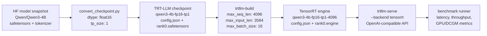
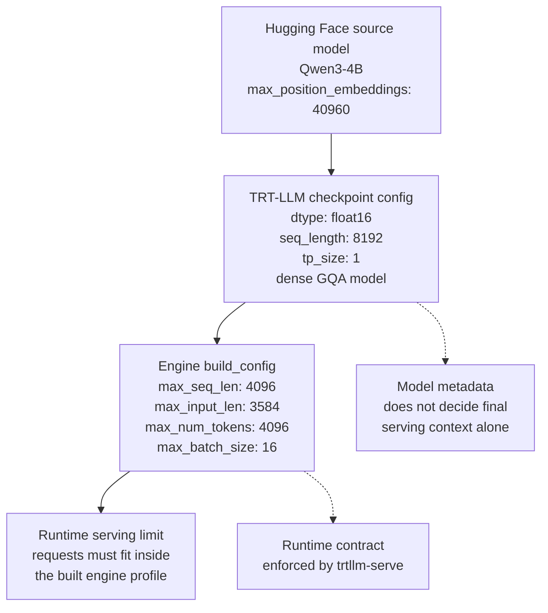

# TensorRT-LLM Conversion and Build Lab

## Purpose

This lab documents the real TensorRT-LLM path for LLM serving:

```text
Hugging Face checkpoint -> TensorRT-LLM checkpoint -> TensorRT engine -> trtllm-serve
```

This is separate from `docs/tensorrt-onnx-lab.md`, which covers generic ONNX import with `trtexec`.

TensorRT-LLM engine artifacts are hardware-specific. Build on the target GPU architecture when possible, especially on Blackwell consumer GPUs such as RTX 5080 (`sm_120`).

## Prerequisites

- NVIDIA GPU with a recent driver and CUDA-compatible container runtime.
- Docker and NVIDIA Container Toolkit configured.
- Repository profile loaded from the repository root:

```bash
source configs/profiles/homelab.env
```

- Hugging Face cache rooted at:

```bash
HF_HOME=/data/LLM/models/hugging-face
```

- TensorRT-LLM image from the active profile:

```bash
TENSORRT_LLM_IMAGE=nvcr.io/nvidia/tensorrt-llm/release:1.2.0rc7
```

The pinned TensorRT-LLM image used by this repo includes the Qwen conversion script at:

```bash
/app/tensorrt_llm/examples/models/core/qwen/convert_checkpoint.py
```

## Workflow Overview

The workflow is based on NVIDIA's `convert_checkpoint.py` + `trtllm-build` pattern:

1. Download or locate the Hugging Face model snapshot.
2. Convert the HF checkpoint into a TensorRT-LLM checkpoint.
3. Build a TensorRT-LLM engine from that checkpoint.
4. Serve the built engine with the TensorRT backend.
5. Benchmark the OpenAI-compatible endpoint.



## Why Qwen3-4B FP16 for Homelab

The default homelab GPU target is RTX 5080 16GB. The comparable `Qwen/Qwen3-8B-FP8` TensorRT-LLM serving path did not reliably fit in this environment, so this lab uses `Qwen/Qwen3-4B` as the practical TensorRT-LLM build target.

The homelab recipe uses a conservative FP16 engine profile:

| Setting | Value |
|---|---:|
| Model | `Qwen/Qwen3-4B` |
| Checkpoint dtype | `float16` |
| Tensor parallel size | `1` |
| Max sequence length | `4096` |
| Max batch size | `16` |
| Convert extra arg | `--load_model_on_cpu` |

## Homelab Qwen3-4B Build

Start from the repository root:

```bash
source configs/profiles/homelab.env
just down tensorrt-llm
```

### Step 1: Convert HF Model to TRT-LLM Checkpoint

```bash
just trtllm-convert-qwen Qwen/Qwen3-4B qwen3-4b-fp16-tp1 float16 1 1 --load_model_on_cpu
```

The recipe accepts either a container-visible local model directory or a Hugging Face repo id. For repo ids such as `Qwen/Qwen3-4B`, it downloads a local snapshot under the artifact root, then passes that concrete directory to TensorRT-LLM's Qwen converter.

### Step 2: Build TensorRT Engine

```bash
just trtllm-build-checkpoint qwen3-4b-fp16-tp1 qwen3-4b-fp16-tp1-4096 4096 3584 4096 16 1
```

Or run conversion and build together. This is the preferred entrypoint for the default lab:

```bash
just trtllm-build-qwen3-4b-lab
```

The combined recipe skips conversion when the target TensorRT-LLM checkpoint already exists. See [Build Arguments](#build-arguments) for the positional values used by the build command.

### Step 3: Serve Engine with TensorRT Backend

```bash
just trtllm-qwen3-4b-engine-up
```

The engine-serving recipe passes `--backend tensorrt` and runtime limits that match the built engine.

### Step 4: Smoke Test

```bash
curl http://localhost:8000/health
curl http://localhost:8000/v1/models
```

### Step 5: Benchmark

```bash
just trtllm-qwen3-4b-engine-bench
```

## Build Arguments

Argument mapping for the default build command:

```bash
just trtllm-build-checkpoint qwen3-4b-fp16-tp1 qwen3-4b-fp16-tp1-4096 4096 3584 4096 16 1
```

| Argument | Value | Meaning |
|---|---:|---|
| checkpoint name | `qwen3-4b-fp16-tp1` | converted TRT-LLM checkpoint |
| engine name | `qwen3-4b-fp16-tp1-4096` | output engine directory |
| max seq len | `4096` | maximum total sequence length |
| max input len | `3584` | maximum prompt length |
| max num tokens / batched tokens | `4096` | batching token budget |
| max batch size | `16` | maximum runtime batch |
| TP size | `1` | tensor parallel size |

## Checkpoint Config Interpretation

The converted checkpoint config at:

```bash
/data/LLM/artifacts/llm-serving-lab/tensorrt-llm/checkpoints/qwen3-4b-fp16-tp1/config.json
```

describes the TensorRT-LLM checkpoint produced from the Hugging Face model. It is not the final engine runtime limit file.

For the default lab, the checkpoint reads as:

```text
Qwen3-4B CausalLM / FP16 / TP1 / dense model / RoPE / GQA / original max positions 40960 / checkpoint seq_length 8192
```

Key fields:

| Field | Value | Meaning |
|---|---:|---|
| `architecture` | `Qwen3ForCausalLM` | Qwen3 text generation architecture |
| `dtype` | `float16` | weights converted as FP16 |
| `hidden_size` | `2560` | transformer hidden dimension |
| `num_hidden_layers` | `36` | transformer layer count |
| `num_attention_heads` | `32` | query attention head count |
| `num_key_value_heads` | `8` | KV head count; this is GQA |
| `head_size` | `128` | dimension per attention head |
| `intermediate_size` | `9728` | MLP / FFN intermediate dimension |
| `vocab_size` | `151936` | tokenizer vocabulary size |
| `max_position_embeddings` | `40960` | original model position capacity |
| `seq_length` | `8192` | checkpoint-level sequence length metadata |
| `mapping.world_size` | `1` | one total rank |
| `mapping.tp_size` | `1` | no tensor parallel split |
| `mapping.pp_size` | `1` | no pipeline parallel split |
| `quantization.quant_algo` | `null` | no weight quantization |
| `quantization.kv_cache_quant_algo` | `null` | no KV cache quantization |
| `moe.num_experts` | `0` | dense model, not MoE |

Important interpretation points:

- This is an FP16 checkpoint, not an INT8, FP8, GPTQ, or AWQ checkpoint. On a 16GB GPU, the model can run, but context length and batch size still consume VRAM quickly through the KV cache.
- This is a single-GPU TP1 checkpoint. `mapping.gpus_per_node: 8` is a node layout value from the TensorRT-LLM mapping config; actual rank usage is determined by `world_size: 1`, `tp_size: 1`, and `pp_size: 1`.
- This is a dense Qwen3 model. `moe.num_experts: 0` means there is no expert routing path.
- The attention layout is grouped query attention. `32` query heads and `8` KV heads means each KV head is shared by 4 query heads, which reduces KV cache memory compared with full multi-head KV storage.
- The RoPE config uses `position_embedding_type: rope_gpt_neox`, `rotary_base: 1000000`, and `max_position_embeddings: 40960`. That describes the source model's long-context position support, not the context limit of this built engine.

Runtime limits come from the engine config at:

```bash
/data/LLM/artifacts/llm-serving-lab/tensorrt-llm/engines-out/qwen3-4b-fp16-tp1-4096/config.json
```

For the default built engine, the relevant `build_config` values are:

| Field | Value | Meaning |
|---|---:|---|
| `max_seq_len` | `4096` | maximum total sequence length served by this engine |
| `max_input_len` | `3584` | maximum prompt length |
| `max_num_tokens` | `4096` | batching token budget |
| `max_batch_size` | `16` | maximum runtime batch |
| `plugin_config.dtype` | `float16` | TensorRT-LLM plugin compute dtype |
| `plugin_config.paged_kv_cache` | `true` | paged KV cache enabled |
| `plugin_config.remove_input_padding` | `true` | input padding removal enabled |

In short, the checkpoint config says the converted model is Qwen3-4B dense FP16 TP1 with GQA and long-context RoPE metadata. The engine config defines what this specific build can serve, and the default lab engine is capped at `4096` total sequence length.



## Artifacts

Generated artifacts are ignored by git and written under:

```bash
/data/LLM/artifacts/llm-serving-lab/tensorrt-llm/checkpoints/
/data/LLM/artifacts/llm-serving-lab/tensorrt-llm/engines-out/
/data/LLM/artifacts/llm-serving-lab/tensorrt-llm/hf-models/
/data/LLM/artifacts/llm-serving-lab/tensorrt-llm/results/
```

Expected files for the default lab:

```text
/data/LLM/artifacts/llm-serving-lab/tensorrt-llm/
|-- hf-models/
|   `-- Qwen_Qwen3-4B/
|       |-- model-*.safetensors
|       |-- tokenizer.json
|       `-- config.json
|-- checkpoints/
|   `-- qwen3-4b-fp16-tp1/
|       |-- config.json
|       `-- rank0.safetensors
|-- engines-out/
|   `-- qwen3-4b-fp16-tp1-4096/
|       |-- config.json
|       `-- rank0.engine
`-- results/
    |-- qwen3-4b-fp16-tp1.convert.log
    |-- qwen3-4b-fp16-tp1-4096.build.log
    `-- qwen3-4b-fp16-tp1-4096.timing.cache
```

Override the artifact root with `TRTLLM_ARTIFACT_DIR` if needed.

## VRAM Tuning

If build or serve hits OOM, reduce limits in this order:

1. Lower `max_batch_size`.
2. Lower `max_num_tokens`.
3. Lower `max_seq_len`.

If conversion completed but engine build failed, rerun the build command from [Build Arguments](#build-arguments). The recipe removes the target engine directory before rebuilding, so a partial `rank0.engine` from a failed serialization is not reused.

## Known Limitations

- TensorRT-LLM does not use ONNX in this flow; there is no `.onnx` model to view with Netron.
- TensorRT-LLM engines are tied to GPU architecture, TensorRT-LLM version, plugin settings, tensor parallel size, and sequence/batch limits.
- `Qwen/Qwen3-8B-FP8` did not reliably serve through TensorRT-LLM on the 16GB RTX 5080 homelab profile.
- The Qwen3-4B path is a practical homelab fallback, not a strict apples-to-apples match with the 8B vLLM/SGLang benchmark target.

## Custom Qwen Models

```bash
just trtllm-convert-qwen <hf-model-or-local-dir> <checkpoint-name> auto 1 1 --load_model_on_cpu
just trtllm-build-checkpoint <checkpoint-name> <engine-name> 4096 3584 4096 16 1
just trtllm-engine-up <engine-name> <hf-tokenizer-id>
```

Use a local HF snapshot path when you need explicit control over model revision or offline builds.

## Datacenter / Multi-GPU Notes

For multi-GPU builds, set the datacenter profile and pass a larger tensor parallel size:

```bash
source configs/profiles/datacenter.env
just trtllm-convert-qwen Qwen/Qwen3-32B qwen3-32b-fp16-tp4 float16 4 4 --load_model_on_cpu
just trtllm-build-checkpoint qwen3-32b-fp16-tp4 qwen3-32b-fp16-tp4-32768 32768 31744 8192 128 4
```

Build on the target GPU architecture whenever possible. Engines built for one GPU architecture should not be assumed portable to another.

## Troubleshooting

- `trtllm-build` requires a TensorRT-LLM checkpoint directory, not a raw Hugging Face snapshot.
- On RTX 5080, stop other GPU workloads first and check `nvidia-smi` before building.
- Keep Hugging Face caches on `/data/LLM/models/hugging-face` via `HF_HOME`.
- If serving an engine directory fails, confirm the command includes `--backend tensorrt`; otherwise `trtllm-serve` treats the path as a Hugging Face/PyTorch model path.
- If startup fails with runtime limit errors, check that `max_batch_size`, `max_num_tokens`, and `max_seq_len` do not exceed the engine build limits.
- If an engine build fails partway through, rerun the build recipe instead of reusing a partial engine directory.

## NVIDIA References

- [TensorRT-LLM documentation](https://docs.nvidia.com/tensorrt-llm/)
- [TensorRT-LLM latest docs](https://nvidia.github.io/TensorRT-LLM/latest/index.html)
- [TensorRT-LLM build workflow](https://nvidia.github.io/TensorRT-LLM/architecture/workflow.html)
- [TensorRT-LLM checkpoint format](https://nvidia.github.io/TensorRT-LLM/architecture/checkpoint.html)
- [`trtllm-build` command](https://nvidia.github.io/TensorRT-LLM/commands/trtllm-build.html)
- [`trtllm-serve` command](https://nvidia.github.io/TensorRT-LLM/commands/trtllm-serve/trtllm-serve.html)
- [Official TensorRT-LLM Qwen example](https://github.com/NVIDIA/TensorRT-LLM/tree/main/examples/models/core/qwen)
