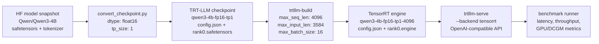
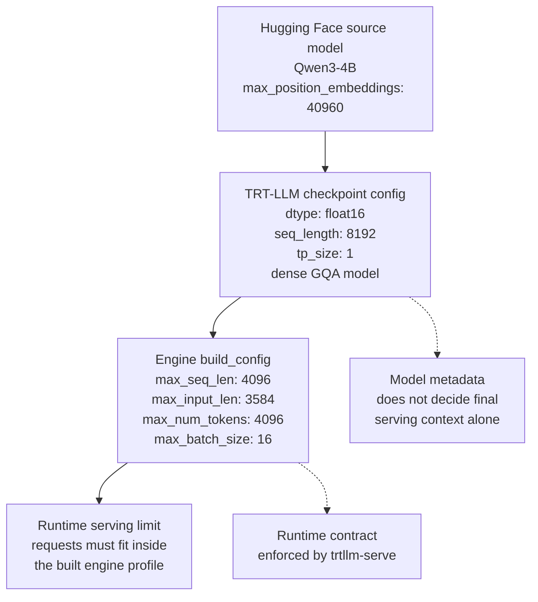

# TensorRT-LLM Conversion and Build Lab

## Table of Contents

- [Purpose](#purpose)
- [Prerequisites](#prerequisites)
- [Workflow Overview](#workflow-overview)
- [Why Qwen3-4B FP16 for Homelab](#why-qwen3-4b-fp16-for-homelab)
- [Homelab Qwen3-4B Build](#homelab-qwen3-4b-build)
- [Build Arguments](#build-arguments)
- [Build Option Deep Dive](#build-option-deep-dive)
- [Build Profile Matrix](#build-profile-matrix)
- [Checkpoint Config Interpretation](#checkpoint-config-interpretation)
- [Artifacts](#artifacts)
- [VRAM Tuning](#vram-tuning)
- [Benchmarking Strategy](#benchmarking-strategy)
- [Known Limitations](#known-limitations)
- [Custom Qwen Models](#custom-qwen-models)
- [Datacenter / Multi-GPU Notes](#datacenter--multi-gpu-notes)
- [Troubleshooting](#troubleshooting)
- [Debugging and Inspection Toolkit](#debugging-and-inspection-toolkit)
- [Appendix A. VRAM Budgeting for TensorRT-LLM Engines](#appendix-a-vram-budgeting-for-tensorrt-llm-engines)
- [Appendix B. Quantization Paths to Explore](#appendix-b-quantization-paths-to-explore)
- [Appendix C. Datacenter Multi-GPU Build Playbook](#appendix-c-datacenter-multi-gpu-build-playbook)
- [NVIDIA References](#nvidia-references)

## Purpose

This lab documents the real TensorRT-LLM path for LLM serving:

```text
Hugging Face checkpoint -> TensorRT-LLM checkpoint -> TensorRT engine -> trtllm-serve
```

This is separate from `docs/tensorrt-onnx-lab.md`, which covers generic ONNX import with `trtexec`.

TensorRT-LLM engine artifacts are hardware-specific. Build on the target GPU architecture when possible, especially on Blackwell consumer GPUs such as RTX 5080 (`sm_120`).

## Prerequisites

- NVIDIA GPU with a recent driver and CUDA-compatible container runtime.
- Docker and NVIDIA Container Toolkit configured.
- Repository profile loaded from the repository root:

```bash
source configs/profiles/homelab.env
```

- Hugging Face cache rooted at:

```bash
HF_HOME=/data/LLM/models/hugging-face
```

- TensorRT-LLM image from the active profile:

```bash
TENSORRT_LLM_IMAGE=nvcr.io/nvidia/tensorrt-llm/release:1.2.0rc7
```

The pinned TensorRT-LLM image used by this repo includes the Qwen conversion script at:

```bash
/app/tensorrt_llm/examples/models/core/qwen/convert_checkpoint.py
```

## Workflow Overview

The workflow is based on NVIDIA's `convert_checkpoint.py` + `trtllm-build` pattern:

1. Download or locate the Hugging Face model snapshot.
2. Convert the HF checkpoint into a TensorRT-LLM checkpoint.
3. Build a TensorRT-LLM engine from that checkpoint.
4. Serve the built engine with the TensorRT backend.
5. Benchmark the OpenAI-compatible endpoint.



## Why Qwen3-4B FP16 for Homelab

The default homelab GPU target is RTX 5080 16GB. The comparable `Qwen/Qwen3-8B-FP8` TensorRT-LLM serving path did not reliably fit in this environment, so this lab uses `Qwen/Qwen3-4B` as the practical TensorRT-LLM build target.

The homelab recipe uses a conservative FP16 engine profile:

| Setting | Value |
|---|---:|
| Model | `Qwen/Qwen3-4B` |
| Checkpoint dtype | `float16` |
| Tensor parallel size | `1` |
| Max sequence length | `4096` |
| Max batch size | `16` |
| Convert extra arg | `--load_model_on_cpu` |

## Homelab Qwen3-4B Build

Start from the repository root:

```bash
source configs/profiles/homelab.env
just down tensorrt-llm
```

### Step 1: Convert HF Model to TRT-LLM Checkpoint

```bash
just trtllm-convert-qwen Qwen/Qwen3-4B qwen3-4b-fp16-tp1 float16 1 1 --load_model_on_cpu
```

The recipe accepts either a container-visible local model directory or a Hugging Face repo id. For repo ids such as `Qwen/Qwen3-4B`, it downloads a local snapshot under the artifact root, then passes that concrete directory to TensorRT-LLM's Qwen converter.

### Step 2: Build TensorRT Engine

```bash
just trtllm-build-checkpoint qwen3-4b-fp16-tp1 qwen3-4b-fp16-tp1-4096 4096 3584 4096 16 1
```

Or run conversion and build together. This is the preferred entrypoint for the default lab:

```bash
just trtllm-build-qwen3-4b-lab
```

The combined recipe skips conversion when the target TensorRT-LLM checkpoint already exists. See [Build Arguments](#build-arguments) for the positional values used by the build command.

### Step 3: Serve Engine with TensorRT Backend

```bash
just trtllm-qwen3-4b-engine-up
```

The engine-serving recipe passes `--backend tensorrt` and runtime limits that match the built engine.

### Step 4: Smoke Test

```bash
curl http://localhost:8000/health
curl http://localhost:8000/v1/models
```

### Step 5: Benchmark

```bash
just trtllm-qwen3-4b-engine-bench
```

## Build Arguments

Argument mapping for the default build command:

```bash
just trtllm-build-checkpoint qwen3-4b-fp16-tp1 qwen3-4b-fp16-tp1-4096 4096 3584 4096 16 1
```

| Argument | Value | Meaning |
|---|---:|---|
| checkpoint name | `qwen3-4b-fp16-tp1` | converted TRT-LLM checkpoint |
| engine name | `qwen3-4b-fp16-tp1-4096` | output engine directory |
| max seq len | `4096` | maximum total sequence length |
| max input len | `3584` | maximum prompt length |
| max num tokens / batched tokens | `4096` | batching token budget |
| max batch size | `16` | maximum runtime batch |
| TP size | `1` | tensor parallel size |

## Build Option Deep Dive

TensorRT-LLM build options define the serving envelope. Changing them requires rebuilding the engine, then serving with runtime limits that do not exceed the built profile.

| Option | Default lab value | Why it matters |
|---|---:|---|
| `--max_batch_size` | `16` | Maximum number of requests the engine can schedule. Higher values can improve throughput but increase memory pressure. |
| `--max_input_len` | `3584` | Maximum prompt length for one request. Keep room below `max_seq_len` for generated tokens. |
| `--max_seq_len` | `4096` | Maximum total length of one request, including prompt and output tokens. |
| `--max_num_tokens` | `4096` | Maximum batched input tokens after input padding is removed. This is the core token budget for inflight batching. |
| `--opt_num_tokens` | not set | Optional optimization target for expected batched token count. Set it near the real workload when doing deeper tuning. |
| `--kv_cache_type paged` | enabled | Uses paged KV cache for transformer models. This is the current lab default. |
| `--remove_input_padding` | engine default enabled | Removes padding before batching. The built engine config records this as `plugin_config.remove_input_padding: true`. |
| `--profiling_verbosity detailed` | not set | Useful when inspecting TensorRT tactic choices and kernel parameters. |
| `--monitor_memory` | enabled | Tracks memory during engine build. This is the current lab default. |
| `--dry_run` | not set | Runs build validation without creating the final engine. Useful before expensive profile experiments. |
| `--visualize_network <dir>` | not set | Exports the TensorRT network as ONNX before engine build for debugging. This is for inspection, not the normal TensorRT-LLM conversion path. |
| `--log_level verbose` | not set | Useful when diagnosing converter or builder behavior. |

The current `just trtllm-build-checkpoint` recipe exposes the main profile knobs as positional arguments:

```bash
just trtllm-build-checkpoint <checkpoint> <engine> <max_seq_len> <max_input_len> <max_num_tokens> <max_batch_size> <workers>
```

For deeper experiments, run `trtllm-build` directly in the TensorRT-LLM container or extend the recipe with the debug or profiling option being tested.

## Build Profile Matrix

Use multiple engine profiles when comparing TensorRT-LLM trade-offs. The important mental model is that TensorRT-LLM does not have one universal engine for every workload; each engine is built for a specific context, batch, and token budget.

| Profile | Example engine name | max seq len | max input len | max num tokens | max batch size | Purpose |
|---|---|---:|---:|---:|---:|---|
| latency | `qwen3-4b-fp16-tp1-2048-b4` | `2048` | `1792` | `2048` | `4` | Lower memory pressure and simpler low-latency testing. |
| balanced | `qwen3-4b-fp16-tp1-4096-b16` | `4096` | `3584` | `4096` | `16` | Default homelab profile used by this lab. |
| long-context | `qwen3-4b-fp16-tp1-8192-b4` | `8192` | `7680` | `8192` | `4` | Longer prompts with lower concurrent batch. |
| throughput | `qwen3-4b-fp16-tp1-4096-b32` | `4096` | `2048` | `8192` | `32` | Higher batching experiments if VRAM allows. |

Start with the balanced profile, then change one axis at a time. If a profile fails, inspect the build log and reduce `max_batch_size`, then `max_num_tokens`, then `max_seq_len`.

When serving a custom profile, runtime limits must stay within the engine build limits. The default `just trtllm-engine-up` helper currently serves with the default lab limits:

```bash
--max_batch_size 16 --max_num_tokens 4096 --max_seq_len 4096
```

If you build a smaller profile such as `2048-b4`, update the serve command or `TENSORRT_LLM_EXTRA_ARGS` to match that engine. Otherwise `trtllm-serve` can fail during executor startup because the requested runtime envelope is larger than the engine profile.

## Checkpoint Config Interpretation

The converted checkpoint config at:

```bash
/data/LLM/artifacts/llm-serving-lab/tensorrt-llm/checkpoints/qwen3-4b-fp16-tp1/config.json
```

describes the TensorRT-LLM checkpoint produced from the Hugging Face model. It is not the final engine runtime limit file.

For the default lab, the checkpoint reads as:

```text
Qwen3-4B CausalLM / FP16 / TP1 / dense model / RoPE / GQA / original max positions 40960 / checkpoint seq_length 8192
```

Key fields:

| Field | Value | Meaning |
|---|---:|---|
| `architecture` | `Qwen3ForCausalLM` | Qwen3 text generation architecture |
| `dtype` | `float16` | weights converted as FP16 |
| `hidden_size` | `2560` | transformer hidden dimension |
| `num_hidden_layers` | `36` | transformer layer count |
| `num_attention_heads` | `32` | query attention head count |
| `num_key_value_heads` | `8` | KV head count; this is GQA |
| `head_size` | `128` | dimension per attention head |
| `intermediate_size` | `9728` | MLP / FFN intermediate dimension |
| `vocab_size` | `151936` | tokenizer vocabulary size |
| `max_position_embeddings` | `40960` | original model position capacity |
| `seq_length` | `8192` | checkpoint-level sequence length metadata |
| `mapping.world_size` | `1` | one total rank |
| `mapping.tp_size` | `1` | no tensor parallel split |
| `mapping.pp_size` | `1` | no pipeline parallel split |
| `quantization.quant_algo` | `null` | no weight quantization |
| `quantization.kv_cache_quant_algo` | `null` | no KV cache quantization |
| `moe.num_experts` | `0` | dense model, not MoE |

Important interpretation points:

- This is an FP16 checkpoint, not an INT8, FP8, GPTQ, or AWQ checkpoint. On a 16GB GPU, the model can run, but context length and batch size still consume VRAM quickly through the KV cache.
- This is a single-GPU TP1 checkpoint. `mapping.gpus_per_node: 8` is a node layout value from the TensorRT-LLM mapping config; actual rank usage is determined by `world_size: 1`, `tp_size: 1`, and `pp_size: 1`.
- This is a dense Qwen3 model. `moe.num_experts: 0` means there is no expert routing path.
- The attention layout is grouped query attention. `32` query heads and `8` KV heads means each KV head is shared by 4 query heads, which reduces KV cache memory compared with full multi-head KV storage.
- The RoPE config uses `position_embedding_type: rope_gpt_neox`, `rotary_base: 1000000`, and `max_position_embeddings: 40960`. That describes the source model's long-context position support, not the context limit of this built engine.

Runtime limits come from the engine config at:

```bash
/data/LLM/artifacts/llm-serving-lab/tensorrt-llm/engines-out/qwen3-4b-fp16-tp1-4096/config.json
```

For the default built engine, the relevant `build_config` values are:

| Field | Value | Meaning |
|---|---:|---|
| `max_seq_len` | `4096` | maximum total sequence length served by this engine |
| `max_input_len` | `3584` | maximum prompt length |
| `max_num_tokens` | `4096` | batching token budget |
| `max_batch_size` | `16` | maximum runtime batch |
| `plugin_config.dtype` | `float16` | TensorRT-LLM plugin compute dtype |
| `plugin_config.paged_kv_cache` | `true` | paged KV cache enabled |
| `plugin_config.remove_input_padding` | `true` | input padding removal enabled |

In short, the checkpoint config says the converted model is Qwen3-4B dense FP16 TP1 with GQA and long-context RoPE metadata. The engine config defines what this specific build can serve, and the default lab engine is capped at `4096` total sequence length.



## Artifacts

Generated artifacts are ignored by git and written under:

```bash
/data/LLM/artifacts/llm-serving-lab/tensorrt-llm/checkpoints/
/data/LLM/artifacts/llm-serving-lab/tensorrt-llm/engines-out/
/data/LLM/artifacts/llm-serving-lab/tensorrt-llm/hf-models/
/data/LLM/artifacts/llm-serving-lab/tensorrt-llm/results/
```

Expected files for the default lab:

```text
/data/LLM/artifacts/llm-serving-lab/tensorrt-llm/
|-- hf-models/
|   `-- Qwen_Qwen3-4B/
|       |-- model-*.safetensors
|       |-- tokenizer.json
|       `-- config.json
|-- checkpoints/
|   `-- qwen3-4b-fp16-tp1/
|       |-- config.json
|       `-- rank0.safetensors
|-- engines-out/
|   `-- qwen3-4b-fp16-tp1-4096/
|       |-- config.json
|       `-- rank0.engine
`-- results/
    |-- qwen3-4b-fp16-tp1.convert.log
    |-- qwen3-4b-fp16-tp1-4096.build.log
    `-- qwen3-4b-fp16-tp1-4096.timing.cache
```

Override the artifact root with `TRTLLM_ARTIFACT_DIR` if needed.

## VRAM Tuning

If build or serve hits OOM, reduce limits in this order:

1. Lower `max_batch_size`.
2. Lower `max_num_tokens`.
3. Lower `max_seq_len`.

If conversion completed but engine build failed, rerun the build command from [Build Arguments](#build-arguments). The recipe removes the target engine directory before rebuilding, so a partial `rank0.engine` from a failed serialization is not reused.

## Benchmarking Strategy

This repository benchmarks TensorRT-LLM through the OpenAI-compatible HTTP endpoint so the result can be compared with vLLM, SGLang, and TGI under the same client path.

| Benchmark path | Purpose |
|---|---|
| repo HTTP benchmark | Cross-engine comparison through the same API surface. |
| `trtllm-bench` | Native TensorRT-LLM engine measurement without this repo's HTTP client wrapper. |
| DCGM / Prometheus | GPU power, utilization, memory, and energy observation. |
| feature validation | API compatibility checks such as streaming, models endpoint, JSON mode, and tool calling. |

Use the repo benchmark for apples-to-apples serving comparisons. Use native TensorRT-LLM benchmarks when tuning a single TensorRT-LLM engine and trying to isolate engine-level performance from HTTP serving behavior.

## Known Limitations

- TensorRT-LLM does not use ONNX in this flow; there is no `.onnx` model to view with Netron.
- TensorRT-LLM engines are tied to GPU architecture, TensorRT-LLM version, plugin settings, tensor parallel size, and sequence/batch limits.
- `Qwen/Qwen3-8B-FP8` did not reliably serve through TensorRT-LLM on the 16GB RTX 5080 homelab profile.
- The Qwen3-4B path is a practical homelab fallback, not a strict apples-to-apples match with the 8B vLLM/SGLang benchmark target.

## Custom Qwen Models

```bash
just trtllm-convert-qwen <hf-model-or-local-dir> <checkpoint-name> auto 1 1 --load_model_on_cpu
just trtllm-build-checkpoint <checkpoint-name> <engine-name> 4096 3584 4096 16 1
just trtllm-engine-up <engine-name> <hf-tokenizer-id>
```

Use a local HF snapshot path when you need explicit control over model revision or offline builds.

## Datacenter / Multi-GPU Notes

For multi-GPU builds, set the datacenter profile and pass a larger tensor parallel size:

```bash
source configs/profiles/datacenter.env
just trtllm-convert-qwen Qwen/Qwen3-32B qwen3-32b-fp16-tp4 float16 4 4 --load_model_on_cpu
just trtllm-build-checkpoint qwen3-32b-fp16-tp4 qwen3-32b-fp16-tp4-32768 32768 31744 8192 128 4
```

Build on the target GPU architecture whenever possible. Engines built for one GPU architecture should not be assumed portable to another.

## Troubleshooting

- `trtllm-build` requires a TensorRT-LLM checkpoint directory, not a raw Hugging Face snapshot.
- On RTX 5080, stop other GPU workloads first and check `nvidia-smi` before building.
- Keep Hugging Face caches on `/data/LLM/models/hugging-face` via `HF_HOME`.
- If serving an engine directory fails, confirm the command includes `--backend tensorrt`; otherwise `trtllm-serve` treats the path as a Hugging Face/PyTorch model path.
- If startup fails with runtime limit errors, check that `max_batch_size`, `max_num_tokens`, and `max_seq_len` do not exceed the engine build limits.
- If an engine build fails partway through, rerun the build recipe instead of reusing a partial engine directory.

## Debugging and Inspection Toolkit

Common host-side checks:

```bash
nvidia-smi
watch -n 1 nvidia-smi
nvidia-smi dmon
jq . /data/LLM/artifacts/llm-serving-lab/tensorrt-llm/checkpoints/qwen3-4b-fp16-tp1/config.json
jq . /data/LLM/artifacts/llm-serving-lab/tensorrt-llm/engines-out/qwen3-4b-fp16-tp1-4096/config.json
grep -iE "error|oom|warning|memory" /data/LLM/artifacts/llm-serving-lab/tensorrt-llm/results/*.log
```

Useful builder-side options for focused debugging:

| Option | Use |
|---|---|
| `--dry_run` | Validate build configuration before the expensive engine build. |
| `--monitor_memory` | Track memory during build. |
| `--profiling_verbosity detailed` | Inspect tactic and kernel-level details. |
| `--visualize_network <dir>` | Export a pre-engine TensorRT network view for debugging. |
| `--log_level verbose` | Increase builder log detail. |

These options are not all exposed by the default `just` recipes. Add them temporarily to the recipe or run `trtllm-build` directly in the TensorRT-LLM container when debugging a specific profile.

## Appendix A. VRAM Budgeting for TensorRT-LLM Engines

A practical TensorRT-LLM memory budget is:

```text
VRAM ~= model weights + KV cache + activation/workspace + runtime overhead
```

For this FP16 Qwen3-4B checkpoint, model weights alone are roughly in the 8GB range before runtime overhead. KV cache then grows with resident token count, layer count, KV head count, head size, and dtype.

Approximate KV cache bytes per resident token for this checkpoint:

```text
2 * num_hidden_layers * num_key_value_heads * head_size * bytes_per_element
= 2 * 36 * 8 * 128 * 2
= 147456 bytes per token
~= 144 KiB per token
```

The `2` accounts for K and V cache tensors. For one request with 4096 resident tokens, the rough KV cache footprint is about:

```text
4096 * 144 KiB ~= 576 MiB
```

That is not the full worst-case batch footprint. Total KV pressure scales with tokens resident across the active batch:

```text
active_resident_tokens_across_batch * 144 KiB
```

For example, a theoretical full `max_batch_size=16` batch where every request reaches 4096 resident tokens would be much larger:

```text
16 * 4096 * 144 KiB ~= 9 GiB
```

Real serving usually lands below that worst case, but the build profile must still reserve for the envelope it can schedule. This is only a planning estimate; TensorRT workspace, CUDA graphs, plugins, allocator behavior, runtime scheduling, and fragmentation add overhead. On a 16GB GPU, treat 4K context as a conservative baseline and increase context or batch only after checking real memory with `nvidia-smi`, DCGM metrics, and build logs.

## Appendix B. Quantization Paths to Explore

The default lab is FP16 because it is the simplest reproducible baseline. Quantization is the next set of experiments when trying to fit larger models, longer context, or higher throughput.

| Path | Purpose |
|---|---|
| FP16 | Baseline path with minimal conversion complexity. |
| BF16 | Datacenter baseline on GPUs where BF16 is the preferred format. |
| FP8 | Hopper and Blackwell performance-oriented path when model support and calibration path are available. |
| INT8 / SmoothQuant | Memory and bandwidth reduction experiments. |
| INT4 AWQ / GPTQ | Aggressive weight compression, often relevant for consumer GPU experiments. |
| KV cache quantization | Reduces long-context KV cache pressure when supported by the model and build path. |

Keep quantized experiments separate from the FP16 baseline. Use distinct checkpoint and engine names so benchmark results remain attributable to the exact build profile.

## Appendix C. Datacenter Multi-GPU Build Playbook

Use this playbook when moving from the single-GPU homelab engine to a larger TensorRT-LLM build on datacenter GPUs.

### 1. Select the Parallelism Plan

Start with tensor parallelism unless the model or cluster shape forces a more complex plan.

| Model size | Starting point | Notes |
|---|---:|---|
| 4B to 8B | `tp_size=1` or `2` | Single GPU is often enough; TP2 can help memory or throughput experiments. |
| 14B to 32B | `tp_size=2` or `4` | Common range for one node with NVLink. |
| 70B class | `tp_size=4` or `8` | Prefer NVLink or high-bandwidth interconnect. Validate memory before long-context builds. |
| MoE models | model-specific | Expert parallelism and MoE plugin choices matter; do not assume dense-model settings transfer directly. |

Keep `world_size`, `tp_size`, and the visible GPU count aligned. A TP4 checkpoint and engine must be built and served with four ranks available.

### 2. Prepare the Datacenter Profile

```bash
source configs/profiles/datacenter.env
export HF_HOME=/data/LLM/models/hugging-face
export CUDA_VISIBLE_DEVICES=0,1,2,3
```

Confirm the target GPUs and interconnect before building:

```bash
nvidia-smi
nvidia-smi topo -m
```

Build on the same GPU architecture that will serve the engine. Do not assume engines are portable across different SM versions or TensorRT-LLM releases.

### 3. Convert the Checkpoint

Example TP4 conversion for a larger Qwen model:

```bash
just trtllm-convert-qwen Qwen/Qwen3-32B qwen3-32b-fp16-tp4 float16 4 4 --load_model_on_cpu
```

The key values are:

| Argument | Value | Meaning |
|---|---:|---|
| checkpoint name | `qwen3-32b-fp16-tp4` | output TensorRT-LLM checkpoint directory |
| dtype | `float16` | checkpoint weight dtype |
| TP size | `4` | tensor parallel ranks |
| workers | `4` | conversion workers |

### 4. Build a Matching Engine

Example long-context TP4 engine:

```bash
just trtllm-build-checkpoint qwen3-32b-fp16-tp4 qwen3-32b-fp16-tp4-32768 32768 31744 8192 128 4
```

The serving envelope is intentionally separate from the model's original context metadata:

| Build field | Example | Trade-off |
|---|---:|---|
| `max_seq_len` | `32768` | Larger context, more KV cache pressure. |
| `max_input_len` | `31744` | Leaves room for generated tokens inside `max_seq_len`. |
| `max_num_tokens` | `8192` | Batch token budget after padding removal. |
| `max_batch_size` | `128` | High throughput target; reduce first if build or serve fails. |
| workers | `4` | Build parallelism, not runtime batch size. |

### 5. Serve with Matching Runtime Limits

The runtime command must not request limits larger than the built engine. For custom datacenter engines, prefer setting the serve args explicitly:

```bash
cd engines/tensorrt-llm
TRTLLM_ARTIFACT_DIR=/data/LLM/artifacts/llm-serving-lab/tensorrt-llm \
MODEL_ID=/engines/qwen3-32b-fp16-tp4-32768 \
TENSOR_PARALLEL_SIZE=4 \
CUDA_VISIBLE_DEVICES=0,1,2,3 \
TENSORRT_LLM_EXTRA_ARGS="--tokenizer Qwen/Qwen3-32B --backend tensorrt --max_batch_size 128 --max_num_tokens 8192 --max_seq_len 32768" \
docker compose up -d
```

Then smoke test:

```bash
curl http://localhost:8000/health
curl http://localhost:8000/v1/models
```

### 6. Benchmark and Compare

Use the same repo benchmark path for cross-engine comparison:

```bash
uv run --project scripts/bench python scripts/bench/run_benchmark.py \
  --engine tensorrt-llm-engine \
  --base-url http://localhost:8000 \
  --model Qwen/Qwen3-32B \
  --out results/tensorrt-llm_engine_qwen3-32b_datacenter.json
```

For TensorRT-LLM-only tuning, add native `trtllm-bench` runs separately and keep those results labeled apart from HTTP endpoint benchmarks.

### 7. Failure Triage

Use this order when a datacenter profile fails:

1. Confirm `CUDA_VISIBLE_DEVICES`, `tp_size`, and engine checkpoint mapping all agree.
2. Reduce `max_batch_size`.
3. Reduce `max_num_tokens`.
4. Reduce `max_seq_len`.
5. Rebuild with `--dry_run`, `--monitor_memory`, or `--profiling_verbosity detailed` when the failure is unclear.
6. Check NCCL, container runtime, and interconnect visibility if multi-rank startup hangs.

## NVIDIA References

- [TensorRT-LLM documentation](https://docs.nvidia.com/tensorrt-llm/)
- [TensorRT-LLM latest docs](https://nvidia.github.io/TensorRT-LLM/latest/index.html)
- [TensorRT-LLM build workflow](https://nvidia.github.io/TensorRT-LLM/architecture/workflow.html)
- [TensorRT-LLM checkpoint format](https://nvidia.github.io/TensorRT-LLM/architecture/checkpoint.html)
- [`trtllm-build` command](https://nvidia.github.io/TensorRT-LLM/commands/trtllm-build.html)
- [`trtllm-serve` command](https://nvidia.github.io/TensorRT-LLM/commands/trtllm-serve/trtllm-serve.html)
- [TensorRT-LLM quantization](https://nvidia.github.io/TensorRT-LLM/features/quantization.html)
- [TensorRT-LLM benchmarking](https://nvidia.github.io/TensorRT-LLM/performance/perf-benchmarking.html)
- [Official TensorRT-LLM Qwen example](https://github.com/NVIDIA/TensorRT-LLM/tree/main/examples/models/core/qwen)
